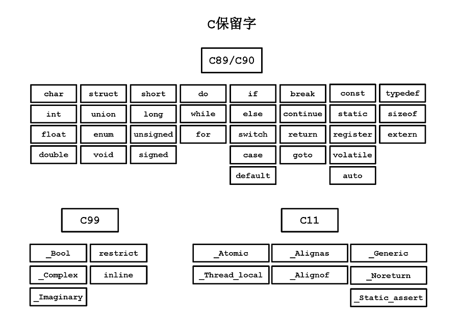

*C11*

# 简介

C语言是一门很接近底层的高级语言，是高性能计算的主要选择，例如：系统编程。

# 入门

## 开发工具

### 核心套件——Clang

#### 安装

#### 交互式环境——REPL

无 

### IDE

### 静态代码分析工具——lint/splint


## 程序结构

C程序主要由函数组成，函数定义不能嵌套，但函数可以调用其他函数，函数包含循序执行语句。

C程序的顶层结构包含：

- 注释
- 预处理指令
- 全局声明
- 函数定义

### 保留字



### 注释

```c
// 单行注释以//开始直到行尾。（仅适用于C99或更新的版本。）

/* 这是块注释，它可以适用于C89。
   块注释可以跨越多行。
   块注释不能再嵌套块注释，但可以嵌套单//行注释。
*/
```

在字符或字符串字面量中的`/*`、`*/`或`//`，不会被视为注释。

如果想要注释掉包含块注释的部分代码，可以使用条件预处理指令：

```c
#if 0
  const double pi = 3.1415926;  /* pi是一个常量 */
  area = pi * r * r;  /* 计算面积 */
#endif
```

预处理器会把每个注释都替换成一个空格。因此，`min/*max*/Value`将变成两个标记：“min Value”。

### 程序入口

每个C程序都必须定义至少一个`main`函数，它是程序开始执行时第一个被调用的函数，是程序结构中最顶层的函数，其他函数会以子例程的方式被它调用。

`main`函数有如下形式：

```c
// 无参形式
int main(void) {}
int main() {}

// 带参形式。
// 参数argc表示在命令行中执行main()函数的参数个数，包含程序名在内，argc的值至少是1；
// 参数argv是这些参数名组成的数组。
int main(int argc, char *argv[]) {
  printf("Program name: %s\n", argv[0]); // argv[0]保存着程序名。
  for (int i=1; i<argc; ++i)
     printf("Argument %d: %s\n", i, argv[i]);
  return 0;
}
```


## 编程过程

### 编码

#### 第一个程序——Hello world

hello.c：

```c
#include <stdio.h>

int main(void) {
    printf("Hello world!");
    return 0;
}
```


#### 源文件

C程序的源代码保存在**源文件**中，扩展名通常是`.c`。

另外，可将多个源文件共享的声明和定义保存到一个单独的头文件（header file）中，然后在每个需要的源文件中利用`#include`指令来引用该头文件。头文件习惯上使用扩展名`.h`。 

#### 字符集

C代码是区分大小写的。

#### 转义序列

#### 编码规范

C语言采用自由的编码格式，没有换行或缩排规则。除了预处理指令的格式化自由度会低一些：一条指令必须独占一行，并且`#`符号前面除了空格与制表符之外，不能有别的字符。

一些通用的编码规范：（非强制）

- 每个新的声明和语句都新起一行；
- 使用缩进以反映语句块的嵌套结构。

### 构建

#### 编译

每个C源文件，连同被包含在其中的头文件，构成一个翻译单元（translation unit）。

编译过程包括两个阶段：

1. 预处理阶段：修改或添加代码；
2. 生成目标代码的实际编译过程。

#### 链接

### 运行

### 调试


# 基本类型

## 数值类型

### 整数类型

### 浮点类型

### 复数浮点类型

## 字符类型

## 布尔类型

## 空类型

C语言中空类型使用`void`表示。

# 声明

## 变量声明

## 常量声明

## 命名规范

# 数组

# 字符串

# 枚举类型

# 表达式

## 算术表达式

## 关系表达式

## 逻辑表达式

## 赋值表达式

### 交换值

## 位运算表达式

## 条件表达式

# 语句

## 语句结束符

## 表达式语句

## 块语句

## 空语句

## 选择语句

### 条件语句

### 多分支语句

## 循环语句

### while循环

### do-while循环

### for循环

## 跳转语句

# 子程序

## 函数

### 函数定义

函数定义不能嵌套在另一个函数的定义之中。

### 函数声明

## 运算符

### 优先级

### 结合性

# 指针

# 结构

# 联合

## 位字段

# 集合类型

## 列表

## 映射/字典

## 集

# 作用域和可见性

# 内存管理

# 类型系统

## 类型兼容

## 类型转换


## 类型推断

# 别名

## 类型别名

# 输入和输出

# 异常处理

# 断言

# 正则表达式

# 并发编程

# 网络编程

# 国际化和本地化

## 日期和时间

# 元编程

# 预处理指令

# 模块

# 构建管理


