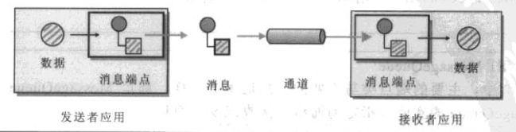

Apache Camel 2.20.1

# 基本概念

## 端点（Endpoint）

端点是负责把应用与通道连接起来的一组代码。

Camel的端点必须实现`org.apache.camel.Endpoint`接口。

## CamelContext

`CamelContext`表示Camel的运行时系统。

## CamelTemplate

## 组件

Camel的组件实际上是一个端点工厂，用于创建端点实例。