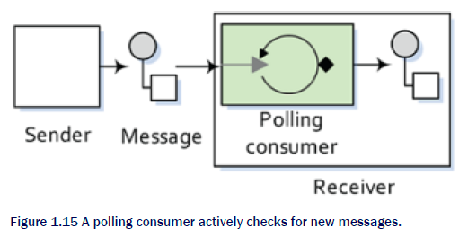

Apache Camel 2.20.2

Camel是一个用于系统之间集成的框架，它的核心是一个路由引擎构建器。

# Camel架构

## 端点（Endpoint）

端点是负责把应用与通道连接起来的一组代码。

在Camel中，使用URI来引用端点，例如：`file:data/inbox?delay=5000`。

`Scheme`指示那个Camel组件将处理那个类型的端点。这里，`file`表示将使用`FileComponent`组件。`FileComponent`以工厂的方式，基于其余的URI部分，创建`FileEndpoint`。

Camel的端点必须实现`org.apache.camel.Endpoint`接口。

### 生产者

生产者是发送消息给一个端点的实体。

### 消费者

消费者是接收由生产者产生的消息，并将这些消息封装到一个交换中，然后交给处理器处理的服务。因此，消费者是交换的来源。

#### 事件驱动消费者

事件驱动消费者监听一个特定的消息通道（例如：TCP/IP端口、JMS队列、Twitter handle、Amazon SQS 队列、WebSocket等等），并等候客户端发送消息到这个通道。当消息到来时，该消费者被唤醒，并将消息拿去处理。

事件驱动消费者通常与客户端-服务器架构和Web服务挂钩。它是企业集成模式中的异步接收者（asynchronous receiver）。

#### polling 消费者

与事件驱动消费者相反，polling消费者总是积极主动地从特定的来源（例如FTP服务器）获取消息，并拿去处理。等到当前消息处理完成后，它再主动从特定来源获取新的消息。

polling消费者是企业集成模式中的同步接收者（synchronous receiver），因为它在处理完成当前消息之前是不会再去获取更多消息的。

## CamelContext

`CamelContext`表示Camel的运行时。

## CamelTemplate

`CamelTemplate`是对`CamelContext`的一个浅封装。

## 组件（Components）

Camel的组件实际上是一个端点工厂，用于创建端点实例。但是，应用通常不直接调用组件来创建端点实例，而是通过`CamelContext`来间接访问组件。

## 消息（Message）

消息封装了系统之间通信的数据，它包括：消息头、消息体（也称为payload）和可选的一些附件。

消息由一个`String`类型的标识符唯一标识。

消息还有一个`fault flag`，用于区分响应消息和故障消息。

例如：请求消息（in消息）、响应消息（out消息）或故障消息（fault消息）。

## 交换（Exchange）

`Exchange`用于表示消息之间的交换。它是在Camel路由过程中用于包含消息的容器。

+ MEP（消息交换模式）：
  - InOnly：单向消息（例如事件消息），这时交换中只包含`In message`；
  - InOut：请求-响应消息，这时交换中包含`In message`和`Out message`。
+ Exception：在路由中如果出现错误，则一个异常将被保存在这个字段中。

## 处理器（Processor）

## 路由（Routes、RouteBuilders）

Camel有两种方式来设定路由：

1. 使用XML文件来配置；
2. 使用一个Java DSL来设定。

