*Java 8*

# 简介

Java是一个静态类型的面向对象编程语言，发布于1996年。

JDK：Java Development Kit，编写Java程序的开发套件。

JRE：Java Runtime Environment，运行Java程序的软件。

Java SE：Java Standard Edition。

Java EE：Java Enterprise Edition。

Java ME：Java Micro Edition。

# 入门

## 开发工具

### 核心套件——JDK

#### 安装

1. 下载JDK，并安装；
2. 设置环境变量`JAVA_HOME`指向JDK安装目录；（可选）
3. 将`$JAVA_HOME/bin`设置到环境变量`PATH`中；（可选）
4. 设置类搜索路径：（可选）
   - 通过环境变量`CLASSPATH`全局设置；
   - 通过`java`命令的`-classpath`或`-cp`参数设置。（推荐）

> 由于运行时库文件（`rt.jar`和在`jre/lib`与`jre/lib/ext`目录下的一些其他的JAR文件）会被自动地搜索，所以不必将它们显式地列在类路径中。
>
> 类路径中`.`表示包含当前目录。
>
> 如果没有显式提供类路径，则会自动提供一个含`.`目录的默认类路径。

#### 交互式环境——JShell


### IDE——Eclipse

### 静态代码分析工具——Coverity、Checkstyle、FindBugs


## 程序结构

Java程序是由类组成的。

### 保留字

### 注释

| 注释     | 说明                                                      |
| -------- | --------------------------------------------------------- |
| // …     | 单行注释。可嵌套。                                        |
| /* … */  | 块注释。可跨多行，但不可以嵌套。                          |
| /** … */ | 文档注释。类似块注释，但可借助`javadoc.exe`工具生成文档。 |

#### 文档注释


### 程序入口

Java程序的入口是如下的`main`方法：

```java
public static void main(String[] args) {
  …
}
```

或者：

```java
public static int main(String[] args) {
  …
}
```

它必须位于`public`或包可见的类中。

如果`main`方法正常退出，则退出代码为`0`，表示成功地运行了程序。如果希望在终止程序时返回其他的代码， 那就需要调用`System.exit`方法。

通常，能够直接运行的类都必须包含`main`方法，否则只能作为库使用。

有些情况下，可以不需要`main`方法也能运行类，例如Applet。因为Web浏览器使用一种不同的方法启动Applet的执行。

## 编程过程

### 编码

#### 第一个程序——Hello world

Hello.java：

```java
public class Hello {
  public static void main(String[] args) {
    System.out.println("Hello world!");
  }
}
```


#### 源文件

Java程序的源代码保存在**源文件**中，扩展名通常是`.java`。

一个源文件中可以包含一个或多个类定义，但是至多只能有一个类是`public`的。

源文件中如果包含`public`类定义，则源文件名必须与`public`类名相同。如果源文件中没有包含`public`类定义，则源文件名可以任意。

#### 字符集

Java代码是区分大小写的。

#### 转义序列

八进制表示的转义序列：`\ddd`。例如：`\237`。

Unicode转义序列：`\uxxxx`。例如：`\u03C0`，表示希腊字母`π`。

特殊字符的转义序列：


> Java中没有续行的转义序列。

所有转义序列均可以出现在字符或字符串字面量中，而只有Unicode转义序列才能出现在字符或字符串之外。例如：

```java
public static void main(String\u005B\ u00SD args) {} //\u005B 和\u005D 是[ 和] 的编码。
```

Unicode转义序列会在解析代码之前得到处理。例如，`\u0022+\u0022` 并不是一个由引号（U+0022) 包围加号构成的字符串。实际上， `\u0022` 会在解析之前转换为`"`， 这会得到`""+""`， 也就是一个空串。

注释中的Unicode转义序列也会被解析：

```java
// Look inside c:\users
```

上面的代码会产生一个语法错误， 因为\u 后面并未跟着4 个十六进制数。

#### 编码规范

Java语言采用自由的编码格式，没有换行或缩排规则。

### 构建

#### 编译

```bash
$ javac Hello.java
```

Java源文件编译后，会生成字节码文件：`Hello.class`。

> 注意：如果JDK使用的编码（默认与操作系统编码一致）与源文件使用的编码不一致，在编译时会报错。这时，应该在javac后加“-encoding 源文件使用的编码”命令行参数进行编译。例如：
>
> ```bash
> $ javac -encoding utf-8 D:/com/ghoolooloo/java/Welcome.java
> ```

> javac在编译一个类时，也会自动编译该类依赖的类。而且，已编译的依赖的源文件有更新，则会自动重新编译这个依赖。
>
> 另外，javac一次可以编译多个源文件，例如：
>
> ```bash
> $ javac A.java B.java *Test.java
> ```

#### 链接

### 运行

运行程序：

```bash
$ java -cp . Hello
```

> 注意：`java`运行的是带有`main()`方法的公有类，而不是字节码文件，因此不要添加`.class`扩展名。
>
> 如果该类属于某个包时，类名要用完整限定名，且该包也要在类路径中。

#### 命令行参数

在运行程序时，可以将命令行参数直接跟在程序后面就可以了，如果有多个命令行参数，则使用空格分隔。如：

```bash
$ java com.ghoolooloo.java.CommandLineParameters -h these are parameters
```

应用程序的命令行参数会传递到`main`方法的字符串数组`args`中。`arg[0]`存放第一个参数（即`"these"`），以此类推。如果没有命令行参数，则`args`的长度为`0`，而不是`null`。

### 调试


# 基本类型

## 数值类型

在Java 中， 所有的数值类型所占据的字节数量与平台无关。

从Java 7 开始，还可以为数值字面量加下划线， 例如：

```java
1_000_000
0b1111_0100_0010_0100_0000
9_432_894.09_78
```

这些下划线只是为了让人更易读，Java 编译器会去除这些下划线。

下面是非法的下划线使用方式：

```java
float pi1 = 3_.1415F; //小数点左右两边都不能使用下划线。
long socialSecurityNumber1 = 999_99_9999_L; //数值后缀前面不能使用下划线。
int x3 = 52_; //下划线不能位于数值的末尾。
int x5 = 0_x52; //下划线不能位于进制前缀的中间。

//以下划线开头的是标识符，而不是数值。
int x1 = _52;
int x6 = 0x_52;
```

### 整数类型


`long`类型数值要带一个后缀`L` 或`l` ( 例如`4000000000L`)。没有后缀的整数字面量默认是`int`类型。

 整数字面量可以表示成十进制、十六进制、八进制和二进制。十六进制数值有一个前缀`Ox` 或`0X` (例如`OxCAFEL`）；八进制有一个前缀`0`（例如， `010`）；从Java 7 开始， 加上前缀`0b`或`0B`就可以写二进制数（例如`0b100`）。

> 注意， Java 的整数类型总是有符号的，没有无符号（unsigned ) 形式的int、long、short 或byte 类型。

### 浮点类型


`float` 类型的数值有一个后缀`F` 或`f` ( 例如， `3.14F`)。没有后缀的浮点数值（如`3.14` ) 默认为`double` 类型。`double` 类型字面量也可以在后面添加后缀D 或d ( 例如，`3.14D`)。

浮点字面量可以表示成十进制和十六进制。十六进制浮点数值有一个前缀`Ox` 或`0X` (例如`Ox1.0p-3`）。

在十六进制表示法中， 使用`p` 表示指数， 而不是`e`。注意： 尾数采用十六进制， 指数采用十进制。指数的基数是`2`， 而不是`10`。

在十进制表示法中，使用`e`表示指数，尾数和指数都采用十进制，指数的基数是`10`。（例如：`0.88e-03`）

所有的浮点数值计算都遵循IEEE 754 规范。具体来说，下面是用于表示溢出和出错情况的三个特殊的浮点数值：

| `Double.POSITIVE_INFINITY`,  `Float.POSITIVE_INFINITY  ` | 正无穷大                                                     |
| -------------------------------------------------------- | ------------------------------------------------------------ |
| `Double.NEGATIVE_INFINITY `,  `Float.NEGATIVE_INFINITY`  | 负无穷大                                                     |
| `Double.NaN`,  `Float.NaN`                               | 非数值（计算`0/0`或者负数的平方根时）。所有“非数值”的值都被认为是不相同的，因而不能使用`==`来检测是否是“非数值”，但可以使用`Double.isNaN()`方法来检测。 |

## 字符类型

`char` 类型的字面量值要用单引号括起来。例如：`W` 是编码值为`65` 所对应的字符常量。

Java使用Unicode表示字符。码点（ code point ) 是指与一个编码表中的某个字符对应的代码值。Unicode 的
码点可以分成17 个代码级别（codeplane)。第一个代码级别称为基本的多语言级别（ basic multilingual plane ), 码点从`U+0000` 到`U+FFFF`, 其中包括经典的Unicode 代码；其余的16个级别码点从`U+10000` 到`U+10FFFF` , 其中包括一些辅助字符（supplementary character)。

UTF-16 编码采用不同长度的编码表示所有Unicode 码点。在基本的多语言级别中， 每个字符用16 位表示，通常被称为代码单元（ code unit ) ; 而辅助字符采用一对连续的代码单元进行编码。这样构成的编码值落人基本的多语言级别中空闲的2048 字节内， 通常被称为替代区域（surrogate area) [ `U+D800` ~ `U+DBFF` 用于第一个代码单元，`U+DC00` ~ `U+DFFF` 用于第二个代码单元]。这样设计十分巧妙， 我们可以从中迅速地知道一个代码单元是一个字符的编码， 还是一个辅助字符的第一或第二部分。例如，`⑪`是八元数集（ http://math.ucr.edu/home/baez/octonions ) 的一个数学符号， 码点为`U+1D546`, 编码为两个代码单元`U+D835` 和`U+DD46`。

在Java 中，`char` 类型描述了UTF-16 编码中的一个代码单元，因此是16位的。强烈建议不要在程序中使用`char` 类型， 除非确实需要处理UTF-16 代码单元，它们太底层了。最好将字符串作为抽象数据类型处理（参见字符串中的“码点和代码单元”）。要将代码点转换成字符串，可使用`new`
`String(Character.toChars(codePoint))`。

`char`类型可以用作整数类型，可以执行算术运算。`char`可以看作是无符号的整数类型。

## 布尔类型

`boolean` ( 布尔）类型有两个值： `false` 和`true`, 用来判定逻辑条件整型值和布尔值之间不能进行相互转换。

## 空类型

Java语言中空类型使用`void`表示。

`void`类型只用于方法的返回值，表示方法没有返回值。

# 声明

声明属于语句。

> 这里的声明主要是指块作用域中的声明，类作用域中的声明参见“字段声明”。

## 变量声明

在Java程序中，变量是基本存储单元。所有变量在使用之前必须声明。在Java 中， 不区分变量的声明与定义：

```java
boolean done;  //未初始化
byte z = 22;  //静态初始化
double a = 3.0, b, c = 5.0;  //同时声明多个变量
double d = Math.sqrt(a * a + c * c);  //动态初始化
```

> 未初始化的局部变量是不会自动初始化的，这与字段或集合的元素不同。例如，数组在实例化之后，如果没有显式初始化，则会将所有数组元素自动初始化为`0` （数值类型、字符类型）、`false` （布尔类型）或`null` （引用类型）。

初始化表达式的结果类型必须与变量的类型相同或兼容，且可以是任意表达式。

> 尽管`$` 是一个合法的Java 字符， 但不要在你自己的代码中使用这个字符。它只用在Java 编译器或其他工具生成的名字中。

## 常量声明

在Java 中， 利用关键字`final` 指示常量。例如：

```java
final double CM_PER_INCH = 2.54;
```

关键字`final` 表示这个变量只能被赋值一次。一旦被赋值之后， 就不能够再更改了。因此，常量必须在声明时就初始化。

初始化表达式的结果类型必须与常量的类型相同或兼容，且可以是任意表达式。

> `const` 是 Java 保留的关键字， 但目前并没有使用。在 Java 中， 必须使用`final`定义常量。

## 命名规范

常量名使用全大写。

# 数组

数组是一种数据结构，用来存储同一类型值的集合。它本质上，是一组连续存储、类型相同的变量。

在Java中，数组是作为类的对象实现的，它是引用类型。

## 一维数组

### 创建数组

#### 数组变量声明

一维数组变量声明的一般形式：

```java
类型[] 数组变量;
类型 数组变量[];
```

> 声明数组变量时，`[]`可以放在类型之后，也可以放在数组变量之后。

例如：

```java
int[] nums, nums2, nums3;
int nums4[], nums5[];
```


#### 数组实例化

声明了数组变量后，实际上该数组对象并不存在。还需要使用`new`运算符为该数组分配内存空间，并赋值给该数组变量：

```java
数组变量 = new 类型[元素数量];
```

`元素数量`不要求是常量，可以是任何整型表达式。并且，它必须是大于或等于 `0`的整数。

> 注意：数组长度为`0` 与`null` 不同。

在Java中，所有数组都是动态分配的。

数组变量声明和实例化可以同时进行——数组变量初始化：

```java
类型[] 数组变量 = new 类型[元素数量];
类型 数组变量[] = new 类型[元素数量];
```

一旦实例化了数组，就不能再改变它的大小（即数组元素数量），但可以改变每个数组元素。如果经常需要在运行过程中扩展数组的大小， 就应该使用另一种数据结构——数组列表（`ArrayList` )。

> Java 数组与C++ 数组在堆栈上有很大不同， 但基本上与分配在堆（heap) 上的数组指针一样。也就是说，
>
> ```java
> intD a = new int[100]; // Java
> ```
>
> 不同于
>
> ```c++
> int a[100]; // C++
> ```
>
> 而等同于
>
> ```c++
> int* a = new int[100]; // C++
> ```
>
> Java 中的`[ ]` 运算符被预定义为检查数组边界， 而且没有指针运算， 即不能通过`a` 加 `1` 得到数组的下一个元素。

##### 数组初始化器

数组在使用`new`实例化过程中，会将所有数组元素自动初始化为`0` （数值类型、字符类型）、`false` （布尔类型）或`null` （引用类型）。

也可以**在声明时**，使用数组初始化器显式将数组元素初始化为特定值：

```java
类型[] 数组变量 = {元素1, 元素2, …, 元素N};
```

> 使用数组初始化器，不需要调用`new`。而且数组初始化器只能出现在声明语句的初始化部分中。

例如：

```java
int smallPrimes[] = {2, 3, 5, 7, 11, 13};
```

数组初始化器中可以使用表达式：

```java
double[] d = {0*0, 1*0, 2*0, 3*0};
```

#### 匿名数组

```java
new 类型[] {元素1, 元素2, …, 元素N}
```

不象数组初始化器只能出现在声明语句的初始化部分中，匿名数组可以出现在表达式可以出现的任何地方。匿名数组常用于为已有的数组变量赋新值：

```java
smallPrimes = new int[] {17, 19, 23, 29, 31, 37};
```

### 使用数组

#### 访问数组元素

通过整型下标可以访问数组中的每个值。

数组的下标总是从 0 开始的。

Java运行时会进行严格的检查，以确保所有数组下标都在正确的范围（下标大于或等于0，且小于数组元素数量）之内，而不会意外地试图保存或访问数组范围之外的值。

#### 获得数组容量

要想获得数组容量（也称数组长度），可以使用数组的`length`属性。

注意：`length`的值只是反映数组的总容量，而不是数组当前实际上包含的（非空）元素个数。

#### 遍历数组

```java
for (int prime : smallPrimes)
  System.out.println(prime);
```

#### 复制数组

由于数组是引用类型，将一个数组赋值给另一个数组，实际上只是复制引用，结果是两个数组变量引用同一个数组对象：

```java
int[] luckyNumbers = smallPrimes;
luckyNumbers[5] = 12; // now smallPrimes[5] is also 12
```

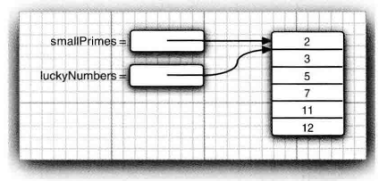

如果希望将一个数组的所有值复制到一个新的数组中去，就要使用`java.util.Arrays.copyof()`方法：

```java
int[] copiedLuckyNumbers = Arrays.copyOf(luckyNumbers, luckyNumbers.length);
```

还可以用这个方法来“改变”数组的大小：

```java
luckyNumbers = Arrays.copyOf(luckyNumbers, 2 * luckyNumbers.length) ;
```

新增加的元素自动初始化为`0` （数值类型、字符类型）、`false` （布尔类型）或`null` （引用类型）。相反，如果数组长度小于原始数组的长度，则只复制最前面的数组元素。

另外，复制数组还可以使用`System.arraycopy()`：

#### 打印数组

```java
int[] a = {1, 2, 3, 4, 5, 6, 7};
System.out.println(Arrays.toString(a));  //[1, 2, 3, 4, 5, 6, 7]
```

#### 数组排序

```java
int[] a = new int[10000];
…
Arrays.sort(a);  // 现在数组a是排好序的了。
```

`Arrays.sort()`使用优化的快速排序算法。

## 多维数组

在Java中，多维数组实际上是数组的数组。

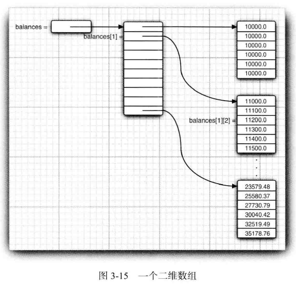

### 创建数组

#### 数组变量声明

多维数组变量声明的一般形式：

```java
类型[]…[] 数组变量;
类型 数组变量[]…[];
```

#### 数组实例化

数组实例化的一般形式：

```java
数组变量 = new 类型[元素数量1]…[元素数量N];
```

数组变量声明和实例化可以同时进行——数组变量初始化：

```java
类型[]…[] 数组变量 = new 类型[元素数量1]…[元素数量N];
类型 数组变量[]…[] = new 类型[元素数量1]…[元素数量N];
```

> 在C++ 中， Java 声明
>
> ```java
> double[][] balances = new double[10][6]; //Java
> ```
>
> 不同于
>
> ```c++
> double balances[10][6] ; // C++
> ```
>
> 也不同于
>
> ```c++
> double (*balances)[6] = new double[10][6] ; // C++
> ```
>
> 而是分配了一个包含10 个指针的数组：
>
> ```c++
> double** balances = new double*[10]; // C++
> ```
>
> 然后， 指针数组的每一个元素被填充了一个包含6 个数字的数组：
>
> ```c++
> for (i = 0; i < 10; i++)
>   balances[i] = new double[6] ;
> ```
>
> 庆幸的是， 在Java中，当创建`new double[10][6]` 时， 这个循环将自动地执行。 当需要不规则的
> 数组时， 只能单独地创建行数组。

##### 数组初始化器

二维数组初始化例子：

```java
int[][] magicSquare =
  {
    {16, 3, 2, 13}，
    {5, 10, 11, 8},
    {9, 6, 7, 12},
    {4, 15, 14, 1}
  }；
```

#### 匿名数组

匿名二维数组例子：

```java
int[][] anonymous = new int[][] {
  {16, 3, 2, 13},
  {5, 10, 11, 8},
  {9, 6, 7, 12},
  {4, 15, 14, 1}
}
```

### 使用数组

#### 遍历数组

使用for循环：

```java
int twoD[][] = new int[4][5];

for (int i=0, k=0; i < twoD.length; i++)
  for (int j=0; j < twoD[i].length; j++)
    twoD[i][j] = k++;
```

使用“for-each”循环：

```java
for (int[] row : towD)
  for (int value : row)
    …
```

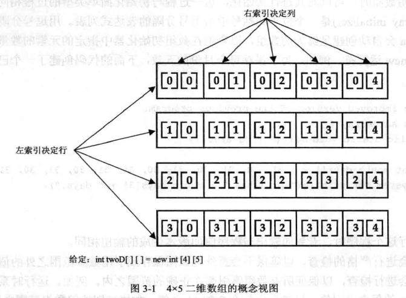

#### 打印数组

```java
System.out.println(Arrays.deepToString(twoD)); //输出[[16, B, 2, 13], [5, 10, 11, 8] , [9, 6, 7, 12], [4, 15, 14, 1]]
```

### 不规则数组

Java的多维数组实际上是一个数组的数组，因此，它并不要求每一维元素的长度要相同。

这种每一维元素长度不相同的多维数组，就是不规则数组。

```java
int twoD[][] = new int[4][];
twoD[0] = new int[1];
twoD[1] = new int[2];
twoD[2] = new int[3];
twoD[3] = new int[4];

int k = 0;

for (int[] row : twoD)
  for (int i=0; i<row.length; i++)
    row[i] = k++;

System.out.println(Arrays.deepToString(twoD));  //[[0], [1, 2], [3, 4, 5], [6, 7, 8, 9]]
```

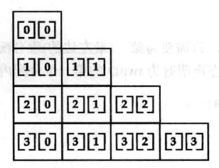

# 字符串

在很多语言中，包括C/C++，字符串是作为字符数组实现的。然而，在Java中不是如此。在Java中，字符串实际上是一个对象（`String`类的实例）。

# 枚举类型

# 表达式

## 算术表达式


算术运算符的操作数必须是数值类型或`char`类型。

### 除法

除法运算符根据操作数类型分为浮点数除法（至少一个操作数是浮点型）和整数除法（两个操作数均为整型）。

```java
6 / 4  //1。整数除法，对结果取整。
6.0 / 4  //1.5
```

> 整数除以0将会产生一个异常， 而浮点数除以0将会得到无穷大或NaN（0 / 0） 结果。

### 求模

`x%y=x-(x/y)*y`，`x`与`y`都是正整数；当`x`和`y`中至少有一个是负整数时，按正整数计算，结果符号同`x`符号。
`f%d=f-[f/d]*d`，`[f/d]`表示不大于`f/d`的最大可能整数。当`f`和`d`中至少有一个是负浮点数，按正浮点数计算，结果符号同`f`符号。
`-0%3`值为`0`（因为在补码中`+0`和`-0`是一样的），`-0.0%3`值为`-0.0`。

### 自增、自减

自增、自减运算符，分为前缀式（位于操作数之前，例如：`++i`）与后缀式（紧随在操作数的后面，例如：`i--`）两种形式。

单独使用自增和自减运算符时，采用哪种形式没有区别。但是，当自增和自减运算符是更大表达式的一部分时，对于前缀式，操作数先自增一或自减一，然后表达式使用自增或自减之后的值进行计算；对于后缀式，表达式先使用操作数原来的值进行计算，然后操作数再自增一或自减一。例如：

```java
x = 42;
y = ++x;  //y=43，x=43。相当于：x = x + 1; y = x;
z = x++;  //z=43, x=44。相当于：z = x; x = x + 1;
```

### 常用数学函数

在`java.lang.Math`类中，包含了各种各样的数学函数。另外，如果得到一个完全可预测的结果比运行速度更重要的话，那么应该使用`java.lang.StrictMath`类。它使用“ 自由发布的Math 库”（fdlibm) 实现算法， 以确保在所有平台上得到相同的结果。

### 严格浮点计算

`strictfp`关键字可用于标记方法和类，用于指示方法和类必须使用严格的浮点计算（即不允许对中间计算结果采用扩展精度）来生成可再现的结果：

```java
public static strictfp void main(String[] args)
```

## 关系表达式


关系运算的结果为布尔类型，但只有`==`和`!=`可操作布尔型操作数。

`==`和`!=`在比较对象时，只是比较对象的引用，而不是对象本身。要比较对象本身要用`equals()`（注：从`Object`对象继承下来的`equals`方法默认也是比较对象引用的，需要重载它才能使它比较对象的本身。它在一些预定义的类中已被重载为比较对象的本身，如`Integer`、`String`等。

## 逻辑表达式


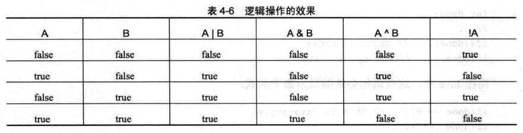

### “短路”逻辑运算

“短路”（short-circuit）逻辑运算是指：对于`A && B`，只要`A`为`false`，则表达式结果就为`false`，而不会对`B`进行多余求值；对于`A || B`，只要`A`为`true`，则表达式结果就为`true`，而不会对`B`进行多余求值。

下面的代码是合法的，并不会由于变量`denom`为0时而出现运行时异常：

```java
if (denom != 0 && num / denom > 10) …
```

### 非“短路”逻辑运算

`&`、`|`、`&=`和`|=`也可以用于处理布尔型操作数（Java将`true`和`false`作为单比特来对待，而不管它在具体实现中的长度），并且结果为布尔型。这些运算符与`&&`和`||`运算符很类似，不过`&`和`|`运算符不采用“短路”方式来求值。也就是说，得到计算结果之前两个操作数都需要计算。

> `&`、`|`、 `&=`和`|=`也是位运算符。

## 赋值表达式

```java
int x, y, z;
x = y = z = 100;  //set x, y, and z to 100
```

### 复合赋值运算符

形如`var op= expression;`的复合赋值表达式都可以改写成：`var = var op expression;`。

复合赋值运算符具有两个优点：

1. 便于输入；
2. 比等价的长格式版本的效率更高。

### 交换值

#### 利用一个临时变量交换数值

```java
int x =5, y=10;  //定义两个变量
        　
int temp = x;    //定义第三临时变量temp并提取x值
x = y;           //把y的值赋给x
y = temp;        //然后把临时变量temp值赋给y
```

#### 利用两个数求和然后相减的方式进行数据交换

```java
int x =5, y=10;   //定义两个变量
         
x = x + y;        //x(15) = 5 + 10；
y = x - y;        //y(5) = x(15) - 10;        
x = x - y;        //x(10) = x(15) - y(5)
```

弊端在于如果 x 和 y 的数值过大的话，超出 int 的值会损失精度。

#### 利用位运算进行数据交换

```java
int x =5, y=10; //定义两个变量
         
x = x^y;
y = x^y;       //y=(x^y)^y
x = x^y;       //x=(x^y)^x
```

## 位运算表达式


### 位逻辑运算

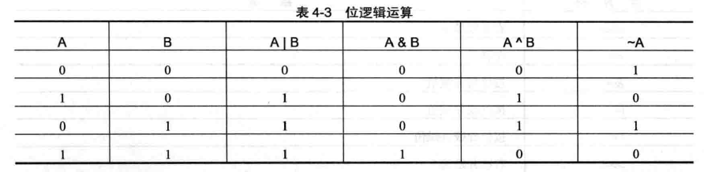

> 利用`&` 并结合使用适当的`2` 的幂， 可以把其他位掩掉， 而只保留其中的某一位。例如， 如果`n` 是一个整数变量， 而且用二进制表示的`n` 从右边数第4 位为`1`，则
>
> ```java
> int fourthBitFromRight = (n & 0b1000) / 0b1000;
> ```
>
> 会返回`1`， 否则返回`0`。

### 移位运算

#### 左移

左移运算符`<<`可以将数值中的所有二进制位向左移动指定位数，每左移一位相当于将原始值乘以`2`：

```java
被操作数<<位数
```

计算结果为：被操作数 * 2^位数%模^

> 被操作数为`int`时，模为`32`；被操作数为`long`时，模为`64`。因此，`x >>> 32`（x为int类型）的值不会变，因为`32 % 32`为`0`。

```java
//a=00000000 00000000 00000000 00000001
//b=11111111 11111111 11111111 11111111
int a = 1, b = -1;

a << 35  //相当于：a << 3。a=8 （00000000 00000000 00000000 00001000）
b << 35  //相当于：b << 3。b=-8（11111111 11111111 11111111 11111000）
```

#### 有符号右移

有符号右移运算符`>>`可以将数值中的所有二进制位向右移动指定位数，并且用*符号位*填充高位。每右移一位相当于将原始值除以`2`：

```java
被操作数 >> 位数
```

计算结果为：被操作数 / 2^位数%模^

```java
int a = 64;  //a=00000000 00000000 00000000 01000000
int b = -64; //b=11111111 11111111 11111111 11000000

a >> 35  //相当于：a >> 3。 a=8 （00000000 00000000 00000000 00001000）
b >> 35  //相当于：b >> 3。 b=-8（11111111 11111111 11111111 11111000）
```

> 有趣的是，如果对`-1`进行有符号右移，结果总是`-1`。 

#### 无符号右移

无符号右移运算符和`>>>`可以将数值中的所有二进制位向右移动指定位数，并且用`0`填充高位。被操作数为非负数时，每右移一位相当于将原始值除以`2`：

```java
被操作数 >>> 位数
```

被操作数为非负数时计算结果为：被操作数 / 2^位数%模^

```java
int a = 64;  //a=00000000 00000000 00000000 01000000
int b = -64; //b=11111111 11111111 11111111 11000000

a >>> 35 //相当于：a >>> 3。a=8 （00000000 00000000 00000000 00001000）
b >>> 35 //相当于：b >>> 3。b=536870904（00011111 11111111 11111111 11111000）
```

> Java没有`<<<`运算符。

####移位`byte`、`short`或`char`类型数值

当移位`byte`、`short`或`char`类型数值时，Java会先进行整型提升，再进行移位运算，移位运算的结果为`int`类型。此外，当将负的`byte`、`short`或`char`类型数值提升为`int`类型时，会进行符号扩展，高阶位将使用`1`填充。所以，对`byte`、`short`或`char`类型数值进行左移操作时，必须抛弃`int`类型结果的高阶字节。完成这个任务最容易的方法是，简单地将结果强制转换为`byte`、`short`或`char`类型：

```java
byte a = 64, b;  //a=0100 0000
int i;

i = a << 2;  //i=256（1 0000 0000）
b = (byte) (a << 2);  //b=0
```

## 条件表达式

```java
布尔表达式 ? 表达式1 : 表达式2
```

`布尔表达式`如果为`true`，就对`表达式1`进行求值；否则对`表达式2`进行求值。条件表达式的结果是对其进行求值的表达式的值。

注意：`表达式1`与`表达式2`的类型要相同或兼容，并且不能为`void`。

## 逗号表达式

Java中没有逗号表达式，for循环的`初始化`和`迭代`中出现的逗号只是一个分隔符，而不是运算符。

# 语句

## 语句结束符

在Java中，语句结束符是`;`。除了块语句外，其他语句均需要以语句结束符结尾。

## 表达式语句

## 块语句

块（即复合语句）是指由一对大括号括起来的0条或任意多条的Java 语句。

```java
{…}
```

块语句可以出现任何单条语句能出现的地方。

### 初始化块

## 空语句

空语句就是只包含一个`;`的语句：

```java
;
```

例如：

```java
while (++i < --j);  //这个循环不需要循环体
```

## 选择语句

### 条件语句

```java
if (条件表达式) 语句
if (条件表达式) 语句1 else 语句2
```

例如：

```java
if (yourSales >= target) {
  performance = "Satisfactory";
  bonus = 100;
}

if (yourSales >= target) {
  performance = "Satisfactory";
  bonus = 100 + 0.01 * (yourSales - target) ;
} else {
  performance = "Unsatisfactory";
  bonus = 0;
}
```

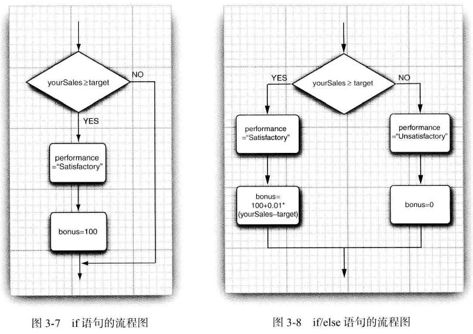

> 注意：`if(…) int i = 1;`是非法的，而要使用：
>
> ```java
> if (…) {
> 	int i =1;
> }
> ```
>
> if语句和循环语句不能只带单条声明语句，但可以将单条声明语句放在块中。这可能是因为声明语句必须与作用域关联，而作用域是由块创建的。

#### 嵌套的if语句

当if语句出现嵌套时，要记住：`else`语句总是与位于同一代码块中最邻近的`if`配对。

形如`if…else if…`结构的嵌套if语句，可以实现类似多分支语句的效果：

```java
if (yourSales >= 2 * target) {
  performance = "Excellent";
  bonus = 1000;
} else if (yourSales >= 1.5 * target) {
  performance = "Fine";
  bonus = 500;
} else if (yourSales >= target) {
  performance = "Satisfactory";
  bonus = 100;
} else {
	System.out.println("You're fired") ;
}
```

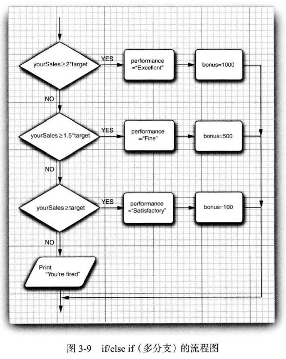

### 多分支语句

相对于一母猪嵌套的`if`语句，`switch`语句通常效率更高。因为，当编译`switch`语句时，Java编译器会检查每个`case`分支的`选项`，并创建一个“跳转表”，该跳转表用于根据`开关表达式`的值选择执行路径。

多分支语句`switch`的一般形式：

```java
switch (开关表达式) {
  case 选项1: 语句1
  case 选项2: 语句2
  …
  case 选项N: 语句N
  default: 默认语句
}
```

`开关表达式`和`选项`的类型：

- `byte`、`short`、`int`、`char`
- 枚举类型
- 从JDK 7 开始，还可以是`String`类型。

> 注意：`开关表达式`不能是`long`类型。

`选项`必须是与`开关表达式`类型兼容的**常量表达式**，并且在当前`switch`中不允许重复。

`switch`语句的工作方式：将`开关表达式`的值与`case`语句中的每个`选项`的值依次进行**相等性**比较。如果发现一个匹配，则从相匹配的`case`标签处开始执行代码，直到遇到`break`语句，或者直到`switch`语句结束处为止。如果没有发现相匹配的分支，则执行`default`子句。

```java
Scanner in = new Scanner(System.in);
System.out.print("Select an option (1, 2, 3, 4) ");
int choice = in.nextlnt();
switch (choice) {
  case 1:
    …
  	break;
  case 2:
    …
  	break;
  case 3:
    …
  	break;
  case 4:
    …
 	  break;
  default:
  	// bad input
    …
  	break;
}
```

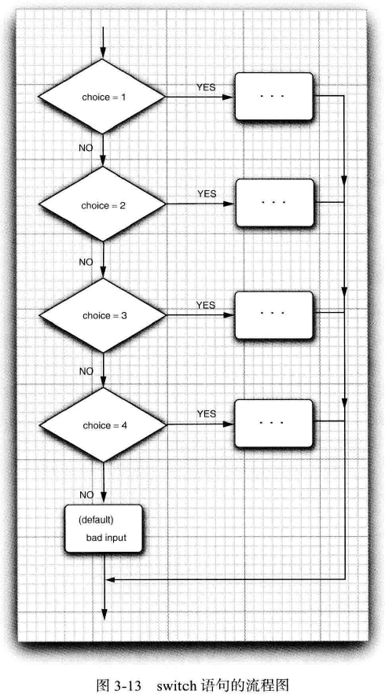

> 如果在`case` 分支语句的末尾没有`break` 语句， 那么就会接着执行下一个`case` 分支语句。
>
> 如果希望在编译时，对`case`分支缺少`break`语句的情况进行警告，可以在编译命令上加上`-Xlint:fallthrough`选项：
>
> ```bash
> $ javac-Xlint:fallthrough Test.java
> ```
>
> 如果在某些情况下确实需要要使用这种“直通式”（fallthrough）行为，可以在其所在方法上加一个标注`@SuppressWarnings("fallthrough")`。这样就不会对这个方法生成警告了。

#### 嵌套的switch语句

```java
switch (count) {
  case 1:
    switch (target) { //嵌套的switch
      case 0:
        …
        break;
      case 1:
        …
        break;
      …
    }
    break;
  case 2:
    …
}
```

在此，内层switch语句的`target`只与内层的case选项匹配，而外层switch语句的`count`只与外层的case选项匹配，它们不会冲突。

#### 在switch语句中使用枚举

当在switch 语句中使用枚举常量时，不必在每个case选项中为枚举量加上枚举名限定。因为，可以由switch 的表达式值确定。例如：

```java
enum Size { SMALL, MEDIUM, LARGE, EXTRA_LARCE };

Size sz = Size.MEDIUM;
switch (sz) {
	case SMALL: // no need to use Size.SMALL
    …
		break;
  …
}
```

## 循环语句

### while循环

while循环的一般形式：

```java
while (条件表达式) 语句
```

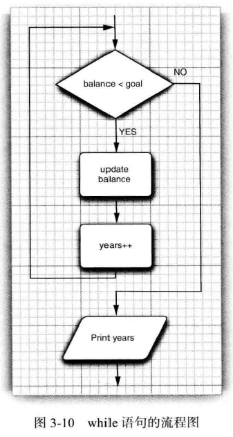

> 如果循环条件的值一开始就为`false`, 则while 循环体一次也不执行。

### do-while循环

有时希望至少执行一次循环体，即使条件表达式最初就为`false`。这时可以使用do-while循环，它的一般形式：

```java
do 语句 while(条件表达式);
```

例如：

```java
do {
  balance += payment;
  double interest = balance * interestRate / 100;
  balance += interest;
  year++;
  // print current balance
  …
  // ask if ready to retire and get input
  …
} while (input.equals("N"))；
```

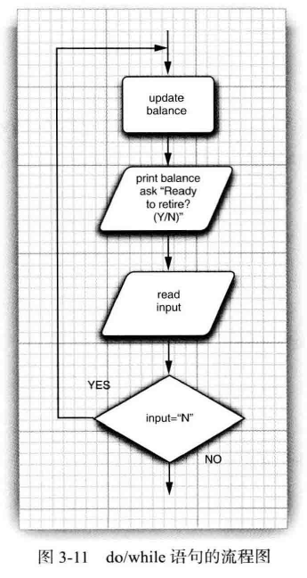


### for循环

while循环和do-while循环都是不确定次数循环，即循环次数是由`条件表达式`控制，无法事先预测。而for循环则是确定次数循环，它的一般形式：

```java
for (初始化 迭代条件 迭代) 语句
```

`初始化`和`迭代`部分可以是单条语句，也可以是逗号分隔的多条语句；而`迭代条件`部分只能是单条语句。它们均不能是块语句。另外，`初始化`、`迭代条件`和`迭代`三个部分都可以省略，但是分隔它们的`;`不能省略。`迭代条件`省略时，默认为`true`：

```java
for (; ;) {
  …
}
```

for循环的执行过程：

1. 当首次开始循环时，执行循环的`初始化`部分。通常该部分用于初始化循环控制变量（计数器）。`初始化`部分只会执行一次。
2. 接着开始迭代：每次迭代，首先对`迭代条件`部分进行求值。如果`迭代条件`的值为`true`，就执行循环体；否则，就终止循环。然后执行`迭代`部分，该部分通常是一个自增或自减表达式。迭代过程一直重复，直到`迭代条件`为false。

在`初始化`部分声明的变量的作用域为该for循环。如果希望该变量在for循环外可用，则要确保该变量是在for循环外，且位于for循环之前声明的。

例如：

```java
for (int i = 1; i <= 10; i++)
  System.out.println(i);
```

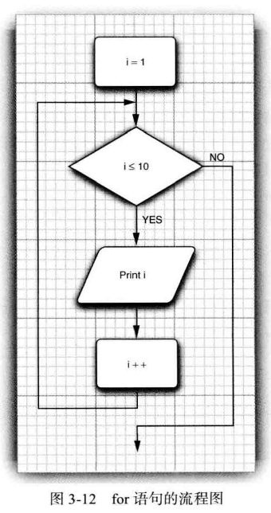

> 在循环中，检测两个浮点数是否相等需要格外小心。下面的for 循环：
>
> ```java
> for (double x = 0; x != 10; x += 0.1) …
> ```
>
> 可能永远不会结束。由于舍入的误差， 最终可能得不到精确值。例如， 在上面的循环中， 因为`0.1` 无法精确地用二进制表示， 所以，`x` 将从`9.999 999 999 999 98` 跳到`10.099 999 999 999 98`。

#### 使用逗号

Java允许在for循环的`初始化`和`迭代`部分包含多条语句，每条语句之间使用逗号分隔：

```java
int a, b;

for (a=1, b=4; a<b; a++, b--) {
  …
}
```

### “for-each”循环

“for-each”循环（开始于JDK 5）的一般形式：

```java
for (类型 迭代变量 : 集合) 语句
```

`集合`必须是一个实现了`Iterable`接口的类对象（例如，`ArrayList`等集合类）或数组，且不能是`null`，但长度可以为`0`。`迭代变量`的类型必须与`集合`的类型兼容。

“for-each”循环每次迭代开始时，从`集合`中检索出下一个元素，并保存到`迭代变量`中，接着执行循环体。依次遍历`集合`中的每个元素，直到遍历结束。

尽管“fot-each”循环会对`集合`一直进行迭代，直到`集合`中所有元素都被遍历过。但是，可以使用`break`语名提前终止循环：

```java
int sum =0;
int nums[] = {1, 2, 3, 4, 5, 6, 7};

for (int x : nums) {
  System.out.println("Value is: " + x);
  sum += x;
  if (x == 5) break;
}
```

尽管“for-each”循环比for循环更加简洁，而且也更不易出错（不必为下标的起始值和终止值而操作），但是，在很多场合下，还是需要使用传统的for循环。例如：如果不希望遍历集合中的每个元素，或者在循环内部需要使用下标值等。

## 跳转语句

> `goto`虽然是Java的保留字，但并没有打算使用。

### break语句

break语句用于退出循环语句和switch语句。

当执行完break语句后，控制流将跳出break语句所在的循环或switch语句，并从紧跟该循环或switch语句的第一条语句处开始执行。

如果在一系列嵌套的循环或switch语句中使用break语句，那么break语句只会中断**break语句所在层**的循环或switch语句，不会中断任何外层的循环或switch语句。

```java
for (int i=0; i<3; i++) {
  System.out.print("Pass " + i + ": ");
  for (int j=0; j<100; j++) {
    if (j == 10) break; //只会中断当前所在循环，对外层循环没有影响。
    System.out.print(j + " ");
  }
  System.out.println();
}
```

> 记住：break语句的设计初衷并不是提供一种终止循环的正常手段，终止循环是条件表达式的目标。只有当发生某些特殊情况时，才应当使用break语句取消循环。

### 带标签的break语句

Java还提供了一种带标签的break语句，用于跳出多重嵌套块。

与break语句不同，带标签的break语句不仅可以中断循环和switch语句，而且还可以中断其他块语句，只要它们是命名块（即在块之前带一个标签）。

命名块的一般形式：

```java
标签: 语句
```

带标签的break语句的一般形式：

```java
break 标签;
```

当执行完带标签的break语句之后，控制流将跳出break语句的标签所指定的命名块，并从紧跟该命名块的第一条语句处开始执行。

```java
boolean t = true;

first: {
  second: {
    third: {
      System.out.println("Before the break.");
      if (t) break second; //中断second块
      System.out.println("This won't execute.");
    }
    System.out.println("This won't execute.");
  }
  System.out.println("This is after second block."); //中断后，跳到这里开始执行。
}
```

带标签的break语句也必须包含在所中断的命名块中，既可以是直接包含在所中断命名块中，也可以是在所中断命名块的任意深度的嵌套块中。带标签的break语句不能中断不包含它的命名块。

带标签的break语句最常见用途之一是退出嵌套的循环：

```java
outer: for (int i=0; i<3; i++) {
  System.out.print("Pass " + i + ": ");
  for (int j=0; j<100; j++) {
    if (j == 10) break outer;
    System.out.print(j + " ");
  }
  System.out.println("This will not print.");
}
System.out.println("Loops complete.");  //中断后，跳到这里开始执行。
```

### continue语句

continue语句只用于循环语句中。

当执行完continue语句后，控制流将提前终止本次迭代，并开始执行下一次迭代。在while和do-while循环中，continue语句导致程序执行控制被直接跳转到控制循环的`条件表达式`处。在for循环中，程序的执行控制首先进入for语句的`迭代`部分，然后到达`迭代条件`处。

```java
for (int i=0; i<10; i++) {
  System.out.print(i + " ");
  if (i%2 == 0) continue;
  System.out.println("");
}
```

如果在一系列嵌套的循环语句中使用continue语句，那么continue语句只会中断**continue语句所在层**的循环的本次迭代，不会中断任何外层的循环的迭代。

### 带标签的continue语句

与带标签的break语句不同，带标签的continue语句仍只能用于带标签的循环语句中，不能用于其他命名块。

带标签的continue语句会提前终止指定标签的循环语句的本次迭代，并开始执行下一次迭代。

```java
outer: for (int i=0; i<10; i++) {
  for (int j=0; j<10; j++) {
    if (j > i) {
      System.out.println();
      continue outer;
    }
    System.out.print(" " + (i * j));
  }
}
System.out.println();
```


### return语句

return语句只出现在方法中，表示要显式地从方法返回。也就是说，return语句导致程序的执行控制转移到方法的调用者。

return语句的一般形式：

```java
return;  //用于返回类型是void的方法中
return 返回表达式;
```

### throw语句

详见”异常处理“。

# 子程序

## 函数

Java中没有全局的函数，只有定义在类中的方法。

## 运算符

Java的运算符都是内置的，不能自定义新的运算符，也不能重载已有的运算符。

大部分运算符只能操作基本类型，但`=`、`==`和`!=`能操作所有对象。此外，`String`类支持`+`和`+=`。

### 优先级


> JDK 8 中添加的箭头运算符（`->`），它的优先级高于赋值运算符，但低于条件运算符。

### 结合性


# 面向对象编程

面向对象程序设计（简称OOP）是当今主流的程序设计范型。

面向对象的程序是由对象组成的， 每个对象包含对用户公开的特定功能部分和隐藏的实现部分。在OOP 中， 不必关心对象的具体实现， 只要能够满足用户的需求即可。

## 对象

在OOP中，对象是人们要进行研究的任何事物，它有三个主要特性：

- 对象的行为（behaviror）：可以对对象施加的操作；
- 对象的状态（state）：保存着描述当前特征的信息；
- 对象的标识（identity）：用于辨别具有相同行为与状态的不同对象。

对象的状态可能会随着时间而发生改变， 但这种改变不会是自发的。对象状态的改变必须通过调用方法来实现，如果不经过方法调用就可以改变对象状态， 只能说明封装性（encapsulation）遭到了破坏。

对象的这些关键特性在彼此之间相互影响着：对象的状态影响它的行为，而行为决定了状态的使用方式。

## 类

类定义了一种新的数据类型，它是Java面向对象的基础。

类抽象了具有相同数据（即状态）和行为的对象。因此，类是对象的模板，对象是类的实例（instance）。对象的状态抽象为类的实例字段（instance field），对象的行为是由类的可调用的方法定义的。

> 在Java中，并不是所有类都具有面向对象特征。例如，`Math`类只封装了功能，没有状态。

### 定义类

类定义的一般形式：

```java
类修饰符 class 类名 扩展的基类 实现的接口 {
  初始化块
  构造器定义
  字段声明
  方法定义
  嵌套类定义
  嵌套接口定义
}
```

其中，字段和方法统称为类的成员。

类定义示例：

```java
class Employee {
  // 实例字段
  private String name;
  private double salary;
  private LocalDate hireDay;

  // 构造器
  public Employee (String n, double s, int year, int month, int day) {
    name = n;
    salary = s;
    hireDay = LocalDate.of(year, month, day);
  }

  // 实例方法
  
  public String getName() {
    return name;
  }

  public double getSalary() {
    return salary;
  }
  
  public LocalDate getHireDay() {
    return hireDay;
  }

  public void raiseSalary(double byPercent) {
    double raise = salary * byPercent / 100;
    salary += raise;
  }
}
```

#### 类的访问控制

对类进行访问控制的修饰符有两个：

- `public`：公有类，在任何代码都可以访问该类。
- 包可访问：默认访问级别。与该类在同一个包下的代码才可以访问它。

### 对象变量声明

由于类定义了一种新的数据类型，因此，可以使用类声明该类型的变量。

对象变量声明的一般形式：

```java
类 对象变量;
```

对象变量只是对象的一个引用，不是对象本身，在没有将对象赋值或初始化给它之前，是不能将该对象的任何方法应用于这个变量上的。

允许有多个对象变量引用同一个对象。例如：

```java
Date deadline;  //deadline是局部变量，不会自动初始化为null。
deadline = new Date();
Date birthday = deadline; //现在birthday和deadline都引用同一个Date对象。
…
deadline = null; //这时，deadline与原来的Date对象“脱钩”，但birthday仍然引用着这个Date对象。
```

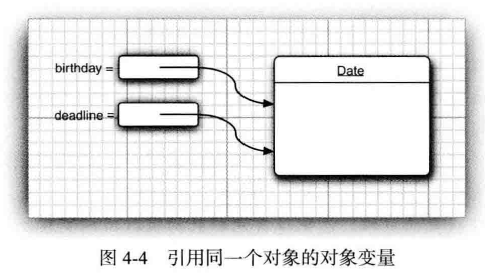

> 当将一个对象变量赋值给另一个对象变量时，不是创建对象的副本，而是创建引用的副本。

另外，对象变量与它引用的对象的生存期也可能是不一致的。对象变量通常存储在栈中，而对象总是存储在堆中。

可以显式地将对象变量设置为`null`， 表明这个对象变量目前没有引用任何对象：

```java
deadline = null;
…
if (deadline != null)
  System.out.println(deadline) ;
```

如果将一个方法应用于一个值为`null` 的对象上，那么就会产生运行时错误。

局部变量不会自动地初始化为`null`，而必须通过调用`new` 或将它们设置为`null` 进行初始化。

> 很多人错误地认为Java 对象引用与C++ 的引用类似。然而， 在C++ 中没有空引用， 并且引用不能被赋值。可以将Java 的对象引用看作C++ 的对象指针。例如，
>
> ```java
> Date birthday; // Java
> ```
>
> 实际上， 等同于
>
> ```c++
> Date* birthday; // C++
> ```
>
> 在Java 中的null 引用对应C++ 中的NULL 指针。
>
> Java的对象引用与C++的对象指针的主要区别：不能像操作真实的指针那样操作对象引用，不能将对象引用指向任意内存位置，也不能像操作整数那样操作对象引用。
>
> 在C++ 中，指针十分令人头疼，并常常导致程序错误。稍不小心就会创建一个错误的指针， 或者造成内存溢出。在Java 语言中，这些问题都不复存在。如果使用一个没有初始化的指针，运行系统将会产生一个运行时错误，而不是生成一个随机的结果。同时，不必担心内存管理问题，垃圾收集器将会处理相关的事宜。

### 类实例化——构造对象

一旦定义了一个类，就可以使用这种新的类型创建该类型的对象。

在Java中，使用构造器（constructor）构造**新**实例。

类实例化的一般形式：

```java
new 构造器名(参数列表);
new 构造器名();  //使用默认构造器构造实例
```

> `new`运算符动态地（在运行时）为对象分配内存，并返回指向对象的引用。因此，在Java中，所有类对象都必须动态分配，总是在**堆**中构造的。

对象变量声明和类实例化可以同时进行——对象变量初始化：

```java
类 对象变量 = new 构造器名(参数列表);
类 对象变量 = new 构造器名();
```

> 在Java中，除了基本类型外，其他类型都是作为对象实现的。基本类型不使用对象实现是为了提高效率。

#### 构造器

构造器定义了当创建类的对象时发生的操作，通常的任务是初始人对象的内部状态。

##### 构造器定义

构造器定义：

```java
构造器修饰符 构造器名(可选的参数列表) {
  构造器体
}
```

构造器与类同名，每个类可以有一个以上的构造器。

构造器与方法有一个重要的不同：构造器没有返回值，连`void`返回类型都不能有，因此不能使用`return`语句。

##### 调用构造器

在构造类的对象时，构造器会运行，以便将实例字段初始化为所希望的状态。

构造器总是伴随着`new` 操作符的执行被调用，而不能对一个已经存在的对象调用构造器来达到重新设置实例域的目的。例如：

```java
janes.Employee("James Bond", 250000, 1950, 1, 1) // ERROR
```

这也是构造器与方法的另一个重要的不同。

##### （无参的）默认构造器

如果没有显式地为类定义构造器，则Java也会自动为该类隐式提供一个无参的默认构造器。但只要显式定义了一个自己的构造器，则Java就不再自动提供任何默认构造器了。

默认构造器自动地将所有实例字段初始化为`0` （数值类型、字符类型）、`false` （布尔类型）或`null` （引用类型）。

##### 构造器的访问控制


#### 初始化块

初始化块（initialization block）是Java中，除了构造器和声明中初始化表达式之外，第三种初始化机制。

在一个类中，可以包含任意多个初始化块。只要构造类的对象，这些初始化块就会被执行。

##### 实例初始化块

实例初始化块可以初始化实例字段和静态字段，可以访问实例方法和静态方法。

```java
class Employee {
  private static int nextld;

  private int id;
  private String name;
  private double salary;

  // object initialization block
  {
    id = nextld;
    nextld++;
  }

  public Employee(String n, double s) {
    name = n;
    salary = s;
  }
  
  public Employee() {
    name = "";
    salary = 0;
  }
  
  …
}
```

在这个示例中，无论使用哪个构造器构造对象，`id` 字段都在实例初始化块中被初始化。首先运行初始化块，然后才运行构造器。

##### 静态初始化块

静态初始化块只可以初始化静态字段，只可以访问静态方法。静态初始化块当第一次加载类时执行，并且只执行一次。

```java
private static int nextId = 1;
…
// static initialization block
static {
  Random generator = new Random()；
  nextId = generator.nextInt(lOOOO);
}
```

> 在JDK7之前，可以使用静态初始块化写一个没有`main`方法的“Hello world”程序。而在JDK7开始，Java程序运行时首先会检查是否有一个`main`方法。没有`main`方法时，在使用`java`运行程序时就会报错。

#### 对象初始化

##### 初始化顺序

1. 首先访问`A.main`方法并加载`A`类；
2. 如果`A`有基类`B`，则加载`B`，并使用声明的初始化部分和静态初始化块，初始化基类`B`的静态字段；
3. 按照在类`A`中声明出现的次序依次执行所有静态字段的声明初始化部分和静态初始化块。只在使用时进行初始化，并且只在第一次使用时进行，以后使用时不进行初始化。在同一静态声明中的静态字段，只要有一个被使用，就都要进行初始化，而不管其它静态字段是否被使用。如果在静态声明语句中没有初始化部分，则系统自动将这些静态字段初始化为默认值（即`0` （数值类型、字符类型）、`false` （布尔类型）或`null` （引用类型））；
4. 依次执行`A.main`方法中的语句；
5. 如果遇到创建`A`类的对象时，则首先将`A`的基类`B`以及`A`类本身中的所有实例字段初始化为默认值，而不管其声明语句中是否有初始化部分；
6. 然后按照在类`B`中声明出现的次序依次执行`B`的所有实例域的声明初始化部分和实例初始化块。最后再执行`B`的相应构造器；
7. 然后按照在类`A`中声明出现的次序依次执行所有实例域的声明初始化部分和实例初始化块。最后再执行`A`的相应构造器；
8. 如果遇到创建其它类型对象，依此类推；
9. 继续执行`A.main`方法中的其余语句。

> 在同一层次中按声明的先后顺序进行初始化。

示例：

```java
import java.util.*;

/**
    * This program demonstrates object construction,
    * Aversion 1.01 2004-02-19
    * ©author Cay Horstmann
    */
public class ConstructorTest {
  public static void main(String[] args) {
    // fill the staff array with three Employee objects
    Employee[] staff = new Employee[3]:
    staff[0] = new Employee("Harry", 40000);
    staff[1] = new Employee(60000) ;
    staff[2] = new Employee() ;
    // print out information about all Employee objects
    for (Employee e : staff)
      System,out.println("name=" + e.getName() + ", id=" + e.getId() + ", salary=" + e.getSalary());
  }
}

class Employee {
  private static int nextId;

  private int id;
  private String name = "";  // instance field initialization
  private double salary;

  // static initialization block
  static {
    Random generator = new Random();
    // set nextld to a random number between 0 and 9999
    nextId = generator.nextInt(10000);
  }

  // object initialization block
  {
    id = nextId;
    nextId++;
  }

  // three overloaded constructors
  public Employee(String n, double s) {
    name = n;
    salary = s;
  }

  public Employee(double s) {
    // calls the Employee(String, double) constructor
    this("Employee #" + nextId, s);
  }

  // the default constructor
  public Employee() {
    // name initialized to "" -- see above
    // salary not explicitly set -- initialized to 0
    // id initialized in initialization block
  }

  public String getName() {
    return name;
  }

  public double getSalary() {
    return salary;
  }

  public int getId() {
    return id;
  }
}
```


##### 初始化的选择

如果字段的值是固定的，则选择在声明时初始化；

如果字段的值是固定的，且初始化过程比较复杂，则选择在初始化块中初始化；

如果字段的值是不固定的，则选择在不同的构造器中初始化。

### 字段

#### 实例字段

##### 实例字段声明

实例字段声明与局部变量或常量声明类似，只不过实例字段声明时可以带上一些修饰符。

```java
private String name;  //私有变量实例字段
public final int ID = 1;  //公有常量实例字段。参见“final字段”。
```

实例变量字段在没有显式初始化时，会被自动初始化为`0` （数值类型、字符类型）、`false` （布尔类型）或`null` （引用类型）。而局部变量不会被自动初始化。

实例常量字段要么在声明时初始化，要么在构造器或实例初始化块中初始化。

初始化表达式的结果类型必须与实例字段的类型相同或兼容，且可以是任意表达式。

> 在C++ 中， 不能直接初始化类的实例字段，所有的字段必须在构造器中设置。但是， 有一个特殊的初始化器列表语法， 如下所示：
>
> ```c++
> Employee::Employee(String n，double s, int y, int m, int d) // C++
>   : name(n),
>     salary(s),
>     hireDay(yf nt d) {
>
> }
> ```
>
> C++ 使用这种特殊的语法来调用字段构造器。在Java 中没有这种必要，因为对象没有子对象，只有指向其他对象的指针。

##### 访问实例字段

在类外面可以使用`.`分隔符来访问对象中有权限访问的实例字段：

```java
对象.实例字段
```

#### 类字段（静态字段）

在声明字段时，如果加上`static`修饰符，则该字段就变成了静态字段。

同一个类的每个对象都有自己的一份实例字段的副本，但它们共享同一个静态字段。

##### 静态字段声明

```java
class Employee {
  private static int nextld = 1;
  private int id;
  …
}
```

每个雇员对象都有一个自己的`id`字段，但这个类的所有实例将共享同一个`nextId`字段。即使没有一个雇员对象，静态域`nextId`也是存在的，它属于类，而不属于任何实例。

比静态变量字段更常用的是静态常量字段：

```java
public static final double PI = 3.14159265358979323846;  //参见“final字段”。
```

通常静态常量字段都是设计成`public`的。

静态常量字段要么在声明时初始化，要么在静态初始化块中初始化。

初始化表达式的结果类型必须与静态字段的类型相同或兼容，且可以是任意表达式。

##### 访问静态字段

静态字段可以看成是类本身的成员，而且本质上是全局的。

在类外面访问静态字段可使用如下两种方式：

```java
类.静态字段   //推荐。不需要构造任何对象，就可以访问静态字段
对象.静态字段
```

#### 字段的访问控制

字段有四种访问控制的修饰符：

- `public`：公有字段，在任何代码都可以访问该字段。
- `protected`：保护字段，在所有子类以及与它在同一个包下的代码可以访问该字段。
- 包可访问：默认访问级别。与该字段在同一个包下的代码可以访问它。
- `private`：私有字段，只有所属类中的代码可以访问该字段。

> 可以用`public` 标记实例字段， 但这是一种极为不提倡的做法。`public` 字段允许程序中的任何方法对其进行读取和修改，这就完全破坏了封装。因此，这里强烈建议将实例字段标记为`private`。

### 方法

#### 实例方法

##### 实例方法定义

方法定义的一般形式：

```java
方法修饰符 返回值类型 方法名(可选的参数列表) {
  方法体
}
```

方法如果不返回值，则它的返回类型就必须是`void`。

方法定义不能嵌套。

在实例方法内部可以直接访问实例或静态成员，而不需要使用`对象.`形式来访问。

> 在C++ 中， 通常在类的外面定义方法：
>
> ```c++
> void Employee::raiseSalary(double byPercent) // C++, not Java
> {
> 	…
> }
> ```
>
> 如果在类的内部定义方法， 这个方法将自动地成为内联（ inline ) 方法：
>
> ```c++
> class Employee {
> 	int getNameQ { return name; } // inline in C++
> }
> ```
>
> 在Java 中， 所有的方法都必须在类的内部定义， 但并不表示它们是内联方法。是否将某个方法设置为内联方法是Java 虚拟机的任务。即时编译器会监视调用那些简洁、经常被调用、没有被重载以及可优化的方法。

##### 调用实例方法

在类外面可以使用`.`分隔符来调用对象中有权限访问的实例方法：

```java
对象.实例方法(可选的实参列表);
```

#### 类方法（静态方法）

静态方法是一种不能向对象实施操作的方法。

##### 静态方法定义

在方法定义时，加上`static`修饰符，就变成了静态方法。

静态方法不能直接访问实例成员，但可以直接访问静态成员。如果要访问实例成员，需要先创建一个对象。

静态方法不能以任何方式引用`this`和`super`。

##### 调用静态方法

静态方法可以看成是类本身的成员，而且本质上是全局的。

在类外面调用静态方法可以使用如下方式：

```java
类.静态方法(可选的实参列表);
对象.静态方法(可选的实参列表);
```

#### 方法参数

##### 参数传递

**形参**是由方法定义的、当调用方法时用于接收数据的变量。

**实参**是当调用方法时传递给方法的数据。

Java语言总是采用**按值调用**（call by value）。也就是说，方法得到的是所有参数值的一个拷贝。

值类型参数传递示例：

```java
public static void tripleValue(double x) {
	x = 3 * x;
}
…
double percent = 10;
tripleValue(percent);  //percent 的值还是10
```

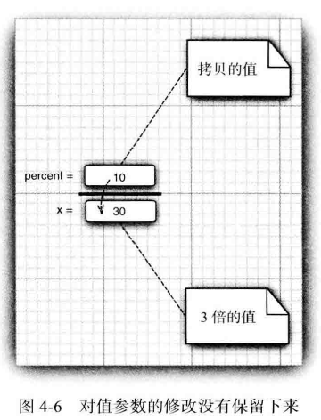

引用类型参数传递示例：

```java
public static void tripleSalary(Employee x) {
	x.raiseSa1ary(200) ;
}
…
harry = new Employee(…) ;
tripleSalary(harry) ;  //现在该雇员工资提升了3倍
```

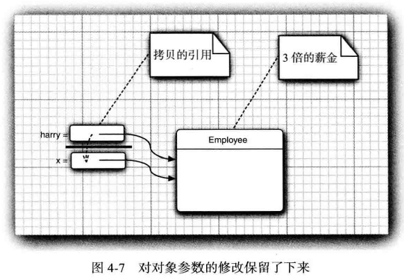

##### 实例方法的隐式参数

在方法定义中，出现在参数列表中的参数实际上是显式参数。每个**实例方法**除了显式参数外，还有一个隐式参数，它就是方法调用的目标或接收者对象（即关键字`this`所表示的对象）。

注意：静态方法没有隐式参数。

##### 可变长度参数

#### 返回值

方法是通过`return`语句来返回值的。

方法返回值的类型必须和方法定义时声明的返回类型兼容。

#### 递归

Java支持递归，递归是一个允许方法调用自身的特性。

```java
class Factorial {
  int fact(int n) {
    if (n==1) return 1;
    return fact(n-1) * n;
  }
}
```

当方法调用自身时，在堆栈上为新的局部变量和参数分配内存，并使用这些新的变量从头开始执行方法的代码。当每次递归调用返回时，将旧的局部变量和参数从堆栈中移除，并将执行控制恢复到方法内部的调用点。

许多例程的递归版本的执行速度比与之等价的迭代版本要更慢一些，因为增加了额外的函数调用负担。对方法进行大量的递归调用可能会导致堆栈溢出。因为参数和局部变量存储在堆栈中，并且每次新的调用都会创建这些变量新的副本，所以可能会耗尽堆栈。

递归的主要优点是，对于某些算法，使用递归可以创建出比迭代版本更清晰并且更简单的版本。

#### 方法的访问控制

方法有四种访问控制的修饰符：

- `public`：公有方法，在任何代码都可以访问该方法。
- `protected`：保护方法，在所有子类以及与它在同一个包下的代码可以访问该方法。
- 包可访问：默认访问级别。与该方法在同一个包下的代码可以访问它。
- `private`：私有方法，只有所属类中的代码可以访问该方法。

```java
class Test {
  int a;  //包可访问
  public int b;  //公有字段
  private int c; //私有字段
  
  void setC(int i) {
    c = i;  //设置私有字段
  }
}

public class AccessTest {
  public static void main(String[] args) {
    Test obj = new Test();
    
    obj.a = 10;
    obj.b = 20;
    // obj.c = 100;  //Error!
    
    obj.setC(100);  //OK
  }
}
```


#### 访问器和更改器

会改变对象状态的方法称为**更改器**（mutator method）；而只是访问对象，不会修改对象状态的方法称为**访问器**（accessor method）。

> 在C++ 中， 带有`const` 后缀的方法是访问器方法，除此之外默认为更改器方法。但是，在Java 语言中，访问器方法与更改器方法在语法上没有明显的区别。

通常，应该将实例字段设置成`private`，而不是`public`。并且，实例字段的访问和更改只能通过公有的字段访问器和字段更改器来进行。这样做有如下好处：

1. 可以容易地改变对象的内部实现，除了该类的方法之外，不会影响其他代码；
2. 更改器可以执行错误检查，避免对字段的错误赋值。

注意：在访问器中，应该避免返回可变对象。例如：

```java
class Employee {
	private Date hireDay;
  …
  public Date getHireDay() {
    return hireDay;  //Bad
  }
  …
}
```

Date类有一个更改器`setTime`，可以设置毫秒数。因此，Date对象是可变的，这就破坏了封装性。例如：

```java
Employee harry = …;
Date d = harry.getHireDay();
double tenYearsInMilliSeconds = 10 * 365.25 * 24 * 60 * 60 * 1000;
d.setTime(d.getTime() - (long) tenYearsInMilliSeconds);
// let's give Harry ten years of added seniority
```

如果确实需要返回一个可变对象的引用，应该首先对它进行克隆（ clone )。例如：

```java
class Employee {
  …
  public Date getHireDay() {
    return (Date) hireDay.clone(); // Ok
  }
  …
}
```

### 重载

如果在同一个类中有多个方法或构造器有相同的名字、不同的参数（参数类型、参数个数或参数次序的不同），便产生了**重载**（overloaded）。方法重载是Java支持多态性的方式之一。

当调用重载方法或构造器时，Java通过用各个方法或构造器给出的形参类型与特定调用所使用的实参类型进行匹配来挑选出相匹配的方法或构造器。

方法或构造器的返回类型不作为判断重载的依据。重载方法或构造器返回类型可以相同，也可以不同。

### `this`关键字

#### 引用当前对象

可以在构造器或实例方法中，使用`this`来引用当前对象。在静态方法中不能访问`this`。 （也见“实例方法的隐式参数”）

#### 调用其他构造器

可以通过下面语句调用同一个类中的另一个构造器：

```java
this(可选的实参列表);
```

调用其他构造器的语句必须是构造器体中的第一条语句。

> 在Java 中， `this` 引用等价于C++ 的`this` 指针。但是， 在C++ 中， 一个构造器不能调用另一个构造器。在C++ 中， 必须将抽取出的公共初始化代码编写成一个独立的方法。

### 嵌套类

嵌套类是定义在另一个类中的类。

使用嵌套类的主要原因：

- 命名控制：嵌套类会引入新的类作用域（与包类似）。
- 访问控制：嵌套类可以访问外围类中的任何成员，包括私有成员。
- 当相要定义一个回调函数且不想编写大量代码时，使用匿名类比较便捷。

嵌套是一种类之间的关系，而不是对象之间的关系。外围类的对象并不包含嵌套类的对象。

嵌套类只是一种编译器现象，与虚拟机无关。编译器会将嵌套类翻译成名为`外围类名$内部类名`的类，而虚拟机对此一无所知。

#### 内部类——非静态嵌套类

内部类的对象有一个隐式引用，它引用了实例化该内部类对象的外围类对象。通过这个指针， 可以访问外围类对象的所有成员（包括私有成员）。反之，外围类（也可能是一个嵌套类）不能访问嵌套类的成员。

> 编译器会自动修改所有内部类的构造器，添加一个接收外围类对象的引用的参数。

```java
class Outer {
  int outerX = 100;
  
  void test() {
    Inner inner = new Inner();
    inner.display();
  }
  
  // 内部类
  class Inner {
    void display() {
      System.out.println("display: outerX = " + outerX);  //可以直接访问外围类的成员
    }
  }
}
```

可以使用如下形式显式使用外围类对象的引用：

```java
外围类.this
```

例如：

```java
void display() {
  System.out.println("display: outerX = " + Outer.this.outerX);
}
```

只能使用`外围类对象.new`来创建内部类的实例。并且当`外围类对象`就是当前的`this`时，`外围类对象.`可以省略。上面代码：

```java
Inner inner = new Inner();
```

实际上，是如下代码的简写：

```java
Inner inner = this.new Inner();
```

如果`外围类对象`不是当前的`this`，而是另一个外围类实例时，则不能省略`外围类对象.`。

如果内部类对外围类的外部可见，则在外围类的外部，就必须使用`外围类对象.new`来创建内部类的实例。并且，在外围类外部，必须使用`外围类.内部类`形式来引用内部类：

```java
Outer outer = new Outer();
Outer.Inner = outer.new Inner();
```

内部类中声明的所有静态字段都必须是`final`。因为，我们希望一个静态字段只有一个实例， 不过对于每个外围类对象，会分别有一个单独的内部类实例。如果这个字段不是`final` , 它可能就不是唯一的。

内部类不能有静态方法。

#### 静态嵌套类

静态嵌套类没有引用外围类对象的指针。

静态嵌套类只能直接访问外围类的静态成员，而不能直接访问外围类的实例成员。要访问外围类的实例成员，必须要先获得外围类的实例。外围类也可以通过`静态嵌套类.静态成员`的方式来访问静态嵌套类的静态成员。

> C++中也有嵌套类，它类似于Java的静态嵌套类。

#### 局部类

#### 匿名类

#### 嵌套类的访问控制

局部内部类不能使用访问控制修饰符。

### 对象析构——`finalize()`方法

有些面向对象的程序设计语言，特别是C++，有显式的析构器方法，其中放置一些当对象不再使用时需要执行的清理代码。在析构器中，最常见的操作是回收分配给对象的存储空间。由于Java 有自动的垃圾回收器，不需要人工回收内存，所以Java 不支持析构器。

当然，某些对象使用了内存之外的其他资源，例如，文件或使用了系统资源的另一个对象的句柄。在这种情况下， 当资源不再需要时，将其回收和再利用将显得十分重要。

可以为任何一个类添加`finalize` 方法。`finalize`方法将在垃圾回收器清除对象之前调用。

```java
protected void finalize() {
  //finalization code here
}
```

在实际应用中，不要依赖于使用`finalize` 方法回收任何短缺的资源，这是因为很难知道这个方法什么时候才能够调用，甚至也不知道是否会执行。

> 有个名为`System.runFinalizersOnExit(true)` 的方法能够确保finalizer 方法在Java 关闭前被调用。不过， 这个方法并不安全，也不鼓励大家使用。有一种代替的方法是使用方法`Runtime.addShutdownHook` 添加“ 关闭钓” （shutdown hook）。

如果某个资源需要在使用完毕后立刻被关闭， 那么就需要由人工来管理。对象用完时，可以应用一个类似`close`、`dispose`等方法来完成相应的清理操作。

## 继承

### `super`关键字

### 方法重写和多态

### `final`修饰符

#### `final`字段、方法参数和局部常量

在声明字段、方法参数或局部常量时，如果加上`final`修饰符，则该字段、方法参数或局部常量在初始化之后，就不能再对它进行修改。

`final`字段必须初始化，它要么在声明时初始化，要么在构造器或初始化块中初始化。

```java
class Employee {
	private final StringBuilder evaluations;
  public Employee() {
    evaluations = new StringBuilder();
  }
  …
}
```

注意：`final`修饰符只是表示 `evaluations` 变量不会再引用其他`StringBuilder`对象，但是，它当前引用的`StringBuilder`对象的状态是可以更改的：

```java
public void giveGoldStar() {
	evaluations.append(LocalDate.now() + ": Gold star!\n");
}
```

`final`方法形参由实参初始化，`final`局部常量只能在声明时初始化。

#### `final`方法

#### `final`类

## `Object`类

## 抽象类


## 对象包装器

对象包装器是不可变的，即一旦构造了包装器，就不允许更改包装在其中的值。

对象包装器类还是final的，因此不能定义它们的子类。

### 自动打包与拆包

将一个基本类型值赋给对象包装器变量时，将执行自动打包。

将一个对象包装器赋给基本类型变量时，将执行自动拆包。

```java
Integer i1 =1;
Integer i2=1;
System.out.println(i1== i2); // 输出“true”

Integer i3 =128;
Integeri4 =128;
System.out.println(i3== i4); // 输出“false”。-128到127，Java会进行池操作，因此使用“==”比较时是相等的，大于127或小于-128时，就不会进行池操作。

Integer i5 =new Integer(1);
Integer i6 =new Integer(1);
System.out.println(i5== i6); //输出“false”
```

# 接口

## 嵌套接口

# 泛型

# 集合类型

## 列表

## 映射/字典

## 集

# 命名空间——包

# 作用域和可见性

作用域决定了对象对程序其他部分的可见性，并且也决定了这些对象的生存期。在作用域中声明的变量或常量，对于作用域之外定义的代码是不可见的（即不可访问）。实际上，作用域规则为封装提供了基础。

Java的作用域分为块作用域和类作用域。

## 块作用域

Java的**块**（以花括号包围，即复合语句）定义了块作用域，每当开始一个新的块时就创建了一个新的块作用域。

块作用域是可以嵌套的。在外层作用域中声明的对象对于内层作用域中的代码是可见的，然而，在内层作用域中声明的对象，在内层作用域之外是不可见的。

在块中，可以在任意位置声明变量或常量，但是只有在声明之后才是有效的。

在块作用域中声明的变量或常量，在声明时创建变量或常量，在离开块作用域时销毁它们。变量或常量的生存期被限制在作用域之内。因此，对于在方法中声明的变量来说，在两次调用该方法之间，变量不会保持它们的值。如果 变量声明包含初始化器，那么每当进入声明变量的块时都会重新初始化变量。

尽管可以嵌套块，但是在内层块中不能声明与外层块具有相同名称的变量或常量：

```java
class ScopeErr {
  public static void main(String[] args) {
    int bar = 1;
    {  //开启一个新的块作用域
      int bar = 2;  //报编译时错误
    }
  }
}
```

## 类作用域

虽然在同一个块作用域中声明两个同名的变量或常量是非法的，但是局部变量或常量（包括参数）可以和类的字段重名，并且它们会屏蔽同名的字段。这时，如果要访问字段，则该字段要加`this.`前缀以示区别。

```java
public Employee (String name, double salary, int year, int month, int day) {
  this.name = name;
  this.salary = salary;
  hireDay = LocalDate.of(year, month, day);
}
```

另外 ，字段之间可以互相屏蔽。例如：子类字段屏蔽从父类继承来的同名字段。这时，要访问这些从父类继承来的同名字段，可在这些字段前加上`super.`前缀。

# 内存管理

## 垃圾回收

在有些语言中，例如C++，动态分配的对象必须通过`delete`运算符手动释放。Java采用一种不同的方法——自动解除分配的内存。完成该工作的技术被称为垃圾回收（garbage collection）。

# 类型系统

## 类型检测

## 类型兼容

## 类型转换

Java的`boolean`类型不能与任何其他类型进行自动或强制转换。极少数的情况确实需要将布尔类型转换为数值类型时，可以使用条件表达式`b ? 1:0`。 

### 自动类型转换

#### 整型提升

在表达式中，中间值要求的精度有时会超出操作数的范围。例如：

```java
byte a = 40;
byte b = 50;
int c = a * b / c;
b = b * 2;  //报错！不能将右侧的int类型结果赋值给左侧的byte类型变量。
```

子表达式`a * b`的结果很容易超出`byte`操作数的范围。为了解决这类问题，当对表达式求值时，Java自动将所有`byte`、`short`或`char`类型的操作都提升为`int`类型，这称为**整型提升**。

例外的情况有：

1. 在声明语句初始化时，右边的数值不自动提升为`int`类型，而是跟左边的类型相同；
2. 在赋值时，右边的值会先自动进行整型提升。但是，在复合赋值中，右侧表达式的值会自动转换为左侧变量的类型。例如：
   `short s = 1; s = s + 1;` 是错误的，而`short s = 1; s += 1;` 则是允许的。
3. 以上1和2两点只是针对整型提升而言。其它情况，则必需强制转换。如：`int i = 0.123`是不合法的；
2. 在方法重载中，在没有与`byte`类型匹配时，则先尝试找是否有`short`类型与之相匹配，如果还没有，再匹配`int`类型。

#### 宽化转换

在表达式中，所有操作数自动转换为它们之中精度最大的类型。


实线箭头表示无精度损失的自动转换。虚线箭头表示可能有精度损失的转换，即需要强制转换。

#### 向上转型

必须是有继承关系的类之间才能进行向上转型。

- 子类型对象可以自动转换为父类型对象。
- 基类的引用可以指向其子类的对象。
- 基类的引用不可以访问其子类对象新增加的成员。
- 在方法参数传递中，可以将子类的对象传递给基类参数。

#### 自动装箱和拆箱

只适用于基本类型与它们对应的包装类之间。

自动装箱和拆箱规范要求boolean、byte、char<=127、介于-128~127之间的short和int被装箱到固定的对象中。因此，这些范围的对象包装器类可以使用 `==` 直接比较。其他范围的对象包装器要使用`equals`方法比较。

### 强制类型转换

强制类型转换的语法格式是在圆括号中给出想要转换的目标类型，后面紧跟待转换的表达式：

```java
(目标类型) 待转换的表达式
```

#### 窄化转换

容量大的数值类型转换为容量小的数值类型，必须显式转换。因为这种转换可能会丢失精度。

整数之间的窄化转换：

```java
int a = 257;
byte b;
b = (byte) a;  //b：1
```

上例中，`a`的值超出了`byte`类型的范围，结果将为`a`除以`byte`类型的范围后的余数。

将浮点值强制转移为整数值时，会发生另一种不同类型的转换——截尾（truncation，即截断小数部分）。如果截尾后的整数部分仍然太大，则参考上例处理：

```java
double d = 323.124;
int i;
byte b;
i = (int) d;  //截尾，i：323
b = (byte) d; //截尾并取模，b：67
```

####向下转型

必须是有继承关系的类之间才能进行向下转型。

通常父类型对象不能显式地转换为子类型对象。只有当父类变量原来就是存放子类型对象时，才能显式转换为相应的子类型对象。例如，`Student`继承于`Person`： 

```java
Person p1 = new Person();
Student s1 = (Student)p1; // 错误，不能转换

Person p2 = new Student();
Student s2 = (Student) p2; //可以转换，因为p2里实际放的是一个Student实例。
```

## 类型推断

# 别名

## 类型别名

# 输入和输出

# 异常处理

# 断言

# 大数值

如果基本的整数和浮点数精度不能够满足需求， 那么可以使用`java.math` 包中的两个很有用的类： `Biglnteger` 和`BigDecimaL` 这两个类可以处理包含任意长度数字序列的数值。`Biglnteger` 类实现了任意精度的整数运算， `BigDecimal` 实现了任意精度的浮点数运算。

使用静态的`valueOf` 方法可以将普通的数值转换为大数值：

```java
BigInteger a = BigInteger.valueOf(100);
```

# 正则表达式

# 并发编程

# 网络编程

# 国际化和本地化

## 日期和时间

《核心》P98-103

# 元编程


# 模块

# 构建管理


