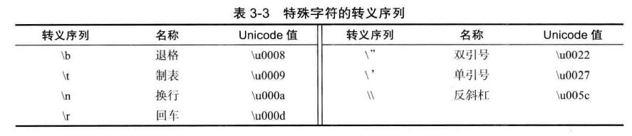
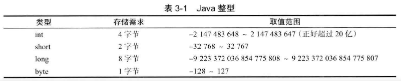
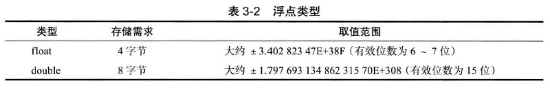
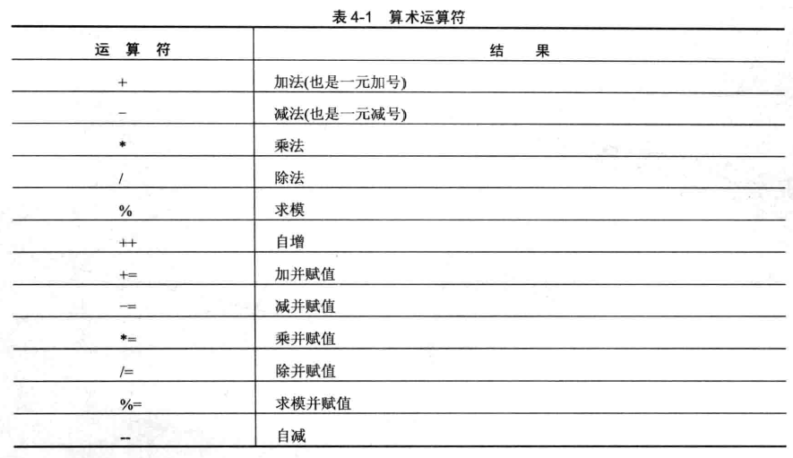
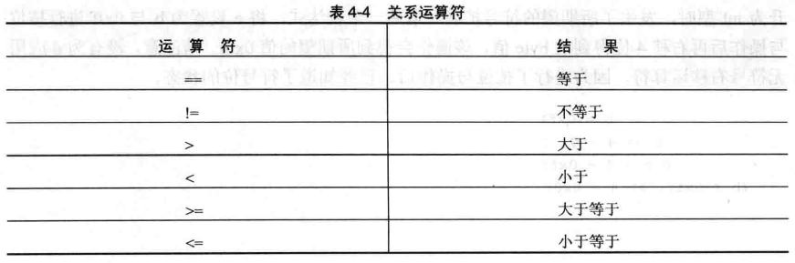
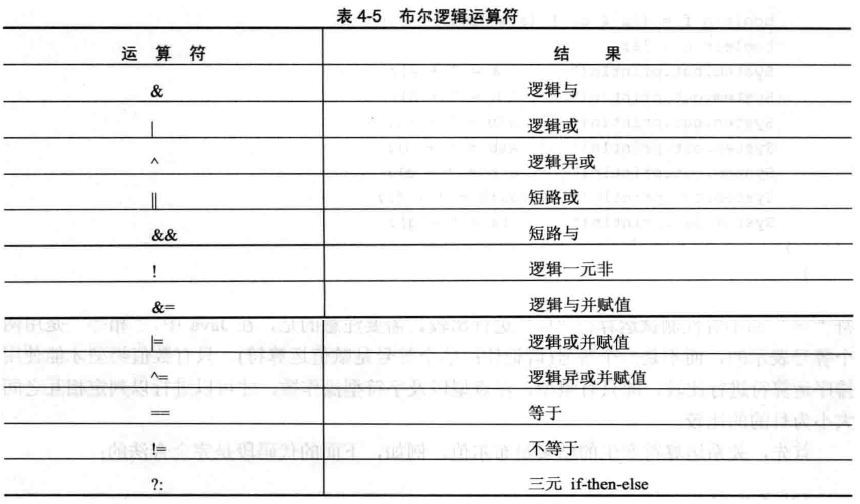
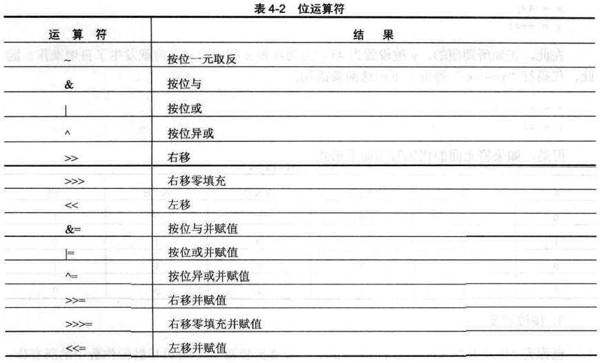
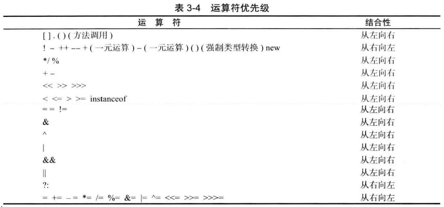
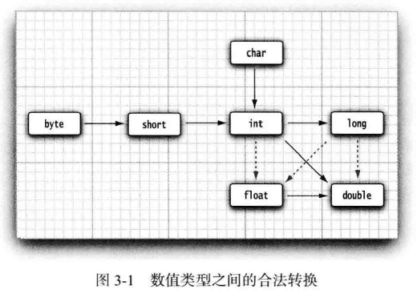

*Java 8*

# 简介

Java是一个强类型的面向对象编程语言，发布于1996年。

JDK：Java Development Kit，编写Java程序的开发套件。

JRE：Java Runtime Environment，运行Java程序的软件。

Java SE：Java Standard Edition。

Java EE：Java Enterprise Edition。

Java ME：Java Micro Edition。

# 入门

## 开发工具

### 核心套件——JDK

#### 安装

1. 下载JDK，并安装；
2. 设置环境变量`JAVA_HOME`指向JDK安装目录；（可选）
3. 将`$JAVA_HOME/bin`设置到环境变量`PATH`中；（可选）
4. 设置类搜索路径：（可选）
   - 通过环境变量`CLASSPATH`全局设置；
   - 通过`java`命令的`-classpath`或`-cp`参数设置。（推荐）

> 由于运行时库文件（`rt.jar`和在`jre/lib`与`jre/lib/ext`目录下的一些其他的JAR文件）会被自动地搜索，所以不必将它们显式地列在类路径中。
>
> 类路径中`.`表示包含当前目录。
>
> 如果没有显式提供类路径，则会自动提供一个含`.`目录的默认类路径。

#### 交互式环境——JShell


### IDE——Eclipse

### 静态代码分析工具——Coverity、Checkstyle、FindBugs


## 程序结构


### 保留字

### 注释

| 注释     | 说明                                                      |
| -------- | --------------------------------------------------------- |
| // …     | 单行注释。可嵌套。                                        |
| /* … */  | 块注释。可跨多行，但不可以嵌套。                          |
| /** … */ | 文档注释。类似块注释，但可借助`javadoc.exe`工具生成文档。 |

#### 文档注释


### 程序入口

Java程序的入口是如下的`main`方法：

```java
public static void main(String[] args) {
  …
}
```

或者：

```java
public static int main(String[] args) {
  …
}
```

它必须位于`public`或包可见的类中。

如果`main`方法正常退出，则退出代码为`0`，表示成功地运行了程序。如果希望在终止程序时返回其他的代码， 那就需要调用`System.exit`方法。

通常，能够直接运行的类都必须包含`main`方法，否则只能作为库使用。

有些情况下，可以不需要`main`方法也能运行类，例如Applet。因为Web浏览器使用一种不同的方法启动Applet的执行。

## 编程过程

### 编码

#### 第一个程序——Hello world

Hello.java：

```java
public class Hello {
  public static void main(String[] args) {
    System.out.println("Hello world!");
  }
}
```


#### 源文件

Java程序的源代码保存在**源文件**中，扩展名通常是`.java`。

源文件名必须与公有类的名字相同，一个源文件中至多只能有一个公有类。

#### 字符集

Java代码是区分大小写的。

#### 转义序列

八进制表示的转义序列：`\ddd`。例如：`\237`。

Unicode转义序列：`\uxxxx`。例如：`\u03C0`，表示希腊字母`π`。

特殊字符的转义序列：



> Java中没有续行的转义序列。

所有转义序列均可以出现在字符或字符串字面量中，而只有Unicode转义序列才能出现在字符或字符串之外。例如：

```java
public static void main(String\u005B\ u00SD args) {} //\u005B 和\u005D 是[ 和] 的编码。
```

Unicode转义序列会在解析代码之前得到处理。例如，`\u0022+\u0022` 并不是一个由引号（U+0022) 包围加号构成的字符串。实际上， `\u0022` 会在解析之前转换为`"`， 这会得到`""+""`， 也就是一个空串。

注释中的Unicode转义序列也会被解析：

```java
// Look inside c:\users
```

上面的代码会产生一个语法错误， 因为\u 后面并未跟着4 个十六进制数。

#### 编码规范

### 构建

#### 编译

```bash
$ javac Hello.java
```

Java源文件编译后，会生成字节码文件：`Hello.class`。

> 注意：如果JDK使用的编码（默认与操作系统编码一致）与源文件使用的编码不一致，在编译时会报错。这时，应该在javac后加“-encoding 源文件使用的编码”命令行参数进行编译。例如：
>
> ```bash
> $ javac -encoding utf-8 D:/com/ghoolooloo/java/Welcome.java
> ```

> javac在编译一个类时，也会自动编译该类依赖的类。

#### 链接

### 运行

运行程序：

```bash
$ java -cp . Hello
```

> 注意：`java`运行的是带有`main()`方法的公有类，而不是字节码文件，因此不要添加`.class`扩展名。
>
> 如果该类属于某个包时，类名要用完整限定名，且该包也要在类路径中。

#### 命令行参数

在运行程序时，可以将命令行参数直接跟在程序后面就可以了，如果有多个命令行参数，则使用空格分隔。如：

```bash
$ java com.ghoolooloo.java.CommandLineParameters -h Tom Rose Mary
```

应用程序的命令行参数会传递到`main`方法的字符串数组`args`中。`arg[0]`存放第一个参数，以此类推。如果没有命令行参数，则`args`的长度为`0`，而不是`null`。

### 调试


# 基本类型

## 数值类型

在Java 中， 所有的数值类型所占据的字节数量与平台无关。

从Java 7 开始，还可以为数值字面量加下划线， 例如：

```java
1_000_000
0b1111_0100_0010_0100_0000
9_432_894.09_78
```

这些下划线只是为了让人更易读，Java 编译器会去除这些下划线。

下面是非法的下划线使用方式：

```java
float pi1 = 3_.1415F; //小数点左右两边都不能使用下划线。
long socialSecurityNumber1 = 999_99_9999_L; //数值后缀前面不能使用下划线。
int x3 = 52_; //下划线不能位于数值的末尾。
int x5 = 0_x52; //下划线不能位于进制前缀的中间。

//以下划线开头的是标识符，而不是数值。
int x1 = _52;
int x6 = 0x_52;
```


### 整数类型



`long`类型数值要带一个后缀`L` 或`l` ( 例如`4000000000L`)。没有后缀的整数字面量默认是`int`类型。

 整数字面量可以表示成十进制、十六进制、八进制和二进制。十六进制数值有一个前缀`Ox` 或`0X` (例如`OxCAFEL`）；八进制有一个前缀`0`（例如， `010`）；从Java 7 开始， 加上前缀`0b`或`0B`就可以写二进制数（例如`0b100`）。

> 注意， Java 的整数类型总是有符号的，没有无符号（unsigned ) 形式的int、long、short 或byte 类型。

### 浮点类型



`float` 类型的数值有一个后缀`F` 或`f` ( 例如， `3.14F`)。没有后缀的浮点数值（如`3.14` ) 默认为`double` 类型。`double` 类型字面量也可以在后面添加后缀D 或d ( 例如，`3.14D`)。

浮点字面量可以表示成十进制和十六进制。十六进制浮点数值有一个前缀`Ox` 或`0X` (例如`Ox1.0p-3`）。

在十六进制表示法中， 使用`p` 表示指数， 而不是`e`。注意： 尾数采用十六进制， 指数采用十进制。指数的基数是`2`， 而不是`10`。

在十进制表示法中，使用`e`表示指数，尾数和指数都采用十进制，指数的基数是`10`。（例如：`0.88e-03`）

所有的浮点数值计算都遵循IEEE 754 规范。具体来说，下面是用于表示溢出和出错情况的三个特殊的浮点数值：

| `Double.POSITIVE_INFINITY`,  `Float.POSITIVE_INFINITY  ` | 正无穷大                                                     |
| -------------------------------------------------------- | ------------------------------------------------------------ |
| `Double.NEGATIVE_INFINITY `,  `Float.NEGATIVE_INFINITY`  | 负无穷大                                                     |
| `Double.NaN`,  `Float.NaN`                               | 非数值（计算`0/0`或者负数的平方根时）。所有“非数值”的值都被认为是不相同的，因而不能使用`==`来检测是否是“非数值”，但可以使用`Double.isNaN()`方法来检测。 |

## 字符类型

`char` 类型的字面量值要用单引号括起来。例如：`W` 是编码值为`65` 所对应的字符常量。

Java使用Unicode表示字符。码点（ code point ) 是指与一个编码表中的某个字符对应的代码值。Unicode 的
码点可以分成17 个代码级别（codeplane)。第一个代码级别称为基本的多语言级别（ basic multilingual plane ), 码点从`U+0000` 到`U+FFFF`, 其中包括经典的Unicode 代码；其余的16个级别码点从`U+10000` 到`U+10FFFF` , 其中包括一些辅助字符（supplementary character)。

UTF-16 编码采用不同长度的编码表示所有Unicode 码点。在基本的多语言级别中， 每个字符用16 位表示，通常被称为代码单元（ code unit ) ; 而辅助字符采用一对连续的代码单元进行编码。这样构成的编码值落人基本的多语言级别中空闲的2048 字节内， 通常被称为替代区域（surrogate area) [ `U+D800` ~ `U+DBFF` 用于第一个代码单元，`U+DC00` ~ `U+DFFF` 用于第二个代码单元]。这样设计十分巧妙， 我们可以从中迅速地知道一个代码单元是一个字符的编码， 还是一个辅助字符的第一或第二部分。例如，`⑪`是八元数集（ http://math.ucr.edu/home/baez/octonions ) 的一个数学符号， 码点为`U+1D546`, 编码为两个代码单元`U+D835` 和`U+DD46`。

在Java 中，`char` 类型描述了UTF-16 编码中的一个代码单元，因此是16位的。强烈建议不要在程序中使用`char` 类型， 除非确实需要处理UTF-16 代码单元，它们太底层了。最好将字符串作为抽象数据类型处理（参见字符串中的“码点和代码单元”）。

`char`类型可以用作整数类型，可以执行算术运算。

## 布尔类型

`boolean` ( 布尔）类型有两个值： `false` 和`true`, 用来判定逻辑条件整型值和布尔值之间不能进行相互转换。

## 空类型

Java语言中空类型使用`void`表示。

# 声明

声明属于语句。

## 变量声明

在Java程序中，变量是基本存储单元。所有变量在使用之前必须声明。在Java 中， 不区分变量的声明与定义：

```java
boolean done;  //未初始化
byte z = 22;  //静态初始化
double a = 3.0, b, c = 5.0;  //同时声明多个变量
double d = Math.sqrt(a * a + c * c);  //动态初始化
```

初始化表达式的结果类型必须与变量的类型相同或兼容。

> 尽管`$` 是一个合法的Java 字符， 但不要在你自己的代码中使用这个字符。它只用在Java 编译器或其他工具生成的名字中。

## 常量声明

在Java 中， 利用关键字`final` 指示常量。例如：

```java
final double CM_PER_INCH = 2.54;
```

关键字`final` 表示这个变量只能被赋值一次。一旦被赋值之后， 就不能够再更改了。

> `const` 是 Java 保留的关键字， 但目前并没有使用。在 Java 中， 必须使用`final`定义常量。

## 命名规范

常量名使用全大写。

# 数组

# 字符串

在很多语言中，包括C/C++，字符串是作为字符数组实现的。然而，在Java中不是如此。在Java中，字符串实际上是对象类型。

# 枚举类型

# 表达式

## 算术表达式



算术运算符的操作数必须是数值类型或`char`类型。

### 除法

除法运算符根据操作数类型分为浮点数除法（至少一个操作数是浮点型）和整数除法（两个操作数均为整型）。

```java
6 / 4  //1。整数除法，对结果取整。
6.0 / 4  //1.5
```


> 整数除以0将会产生一个异常， 而浮点数除以0将会得到无穷大或NaN（0 / 0） 结果。

### 求模

### 自增、自减


### 常用数学函数

在`java.lang.Math`类中，包含了各种各样的数学函数。另外，如果得到一个完全可预测的结果比运行速度更重要的话，那么应该使用`java.lang.StrictMath`类。它使用“ 自由发布的Math 库”（fdlibm) 实现算法， 以确保在所有平台上得到相同的结果。


### 严格浮点计算

`strictfp`关键字可用于标记方法和类，用于指示方法和类必须使用严格的浮点计算（即不允许对中间计算结果采用扩展精度）来生成可再现的结果：

```java
public static strictfp void main(String[] args)
```


## 关系表达式




## 逻辑表达式




## 赋值表达式

### 交换值

## 位运算表达式




## 条件表达式

# 语句

## 语句结束符

## 表达式语句

## 块语句

## 空语句

## 选择语句

### 条件语句

### 多分支语句

## 循环语句

### while循环

### do-while循环

### for循环

## 跳转语句

# 子程序

## 函数

Java中没有全局的函数，只有定义在类中的方法。

## 运算符

Java的运算符都是内置的，不能自定义新的运算符。

### 优先级



### 结合性

# 命名空间——包


# 面向对象编程

无

# 泛型

# 集合类型

## 列表

## 映射/字典

## 集

# 作用域和可见性

作用域决定了对象对程序其他部分的可见性，并且也决定了这些对象的生存期。在作用域中声明的变量或常量，对于作用域之外定义的代码是不可见的（即不可访问）。实际上，作用域规则为封装提供了基础。

Java的作用域分为块作用域和类作用域。

## 块作用域

Java的**块**（以花括号包围，即复合语句）定义了块作用域，每当开始一个新的块时就创建了一个新的块作用域。

块作用域是可以嵌套的。在外层作用域中声明的对象对于内层作用域中的代码是可见的，然而，在内层作用域中声明的对象，在内层作用域之外是不可见的。

在块中，可以在任意位置声明变量或常量，但是只有在声明之后才是有效的。

在块作用域中声明的变量或常量，在声明时创建变量或常量，在离开块作用域时销毁它们。变量或常量的生存期被限制在作用域之内。因此，对于在方法中声明的变量来说，在两次调用该方法之间，变量不会保持它们的值。如果 变量声明包含初始化器，那么每当进入声明变量的块时都会重新初始化变量。

尽管可以嵌套块，但是在内层块中不能声明与外层块具有相同名称的变量或常量：

```java
class ScopeErr {
  public static void main(String[] args) {
    int bar = 1;
    {  //开启一个新的块作用域
      int bar = 2;  //报编译时错误
    }
  }
}
```


# 内存管理

# 类型系统

## 类型检测

## 类型兼容

## 类型转换

Java的`boolean`类型不能与任何其他类型进行自动或强制转换。极少数的情况确实需要将布尔类型转换为数值类型时，可以使用条件表达式`b ? 1:0`。 

### 自动类型转换

#### 整型提升

在表达式中，中间值要求的精度有时会超出操作数的范围。例如：

```java
byte a = 40;
byte b = 50;
int c = a * b / c;
b = b * 2;  //报错！不能将右侧的int类型结果赋值给左侧的byte类型变量。
```

子表达式`a * b`的结果很容易超出`byte`操作数的范围。为了解决这类问题，当对表达式求值时，Java自动将所有`byte`、`short`或`char`类型的操作都提升为`int`类型，这称为**整型提升**。

#### 宽化转换

在表达式中，所有操作数自动转换为它们之中精度最大的类型。



实线箭头表示无精度损失的自动转换。虚线箭头表示可能有精度损失的转换，即需要强制转换。

#### 向上转型

必须是有继承关系的类之间才能进行向上转型。

#### 自动装箱和拆箱

只适用于基本类型与它们对应的包装类之间。

自动装箱和拆箱规范要求boolean、byte、char<=127、介于-128~127之间的short和int被装箱到固定的对象中。因此，这些范围的对象包装器类可以使用 `==` 直接比较。其他范围的对象包装器要使用`equals`方法比较。

### 强制类型转换

强制类型转换的语法格式是在圆括号中给出想要转换的目标类型，后面紧跟待转换的表达式：

```java
(目标类型) 待转换的表达式
```

#### 窄化转换

整数之间的窄化转换：

```java
int a = 257;
byte b;
b = (byte) a;  //b：1
```

上例中，`a`的值超出了`byte`类型的范围，结果将为`a`除以`byte`类型的范围后的余数。

将浮点值强制转移为整数值时，会发生另一种不同类型的转换——截尾（truncation，即截断小数部分）。如果截尾后的整数部分仍然太大，则参考上例处理：

```java
double d = 323.124;
int i;
byte b;
i = (int) d;  //截尾，i：323
b = (byte) d; //截尾并取模，b：67
```


####向下转型

必须是有继承关系的类之间才能进行向下转型。

## 类型推断

# 别名

## 类型别名

# 输入和输出

# 异常处理

# 断言

# 正则表达式

# 并发编程

# 网络编程

# 国际化和本地化

## 日期和时间

# 元编程

# 预处理指令

# 模块

# 构建管理

# 测试


