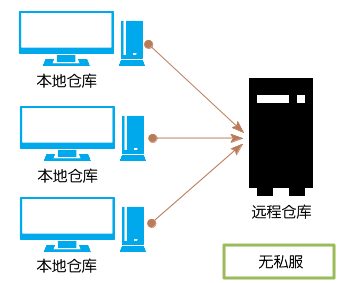
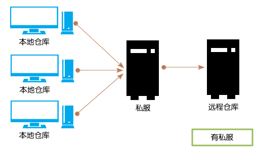
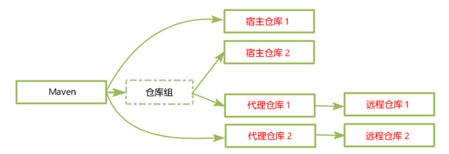
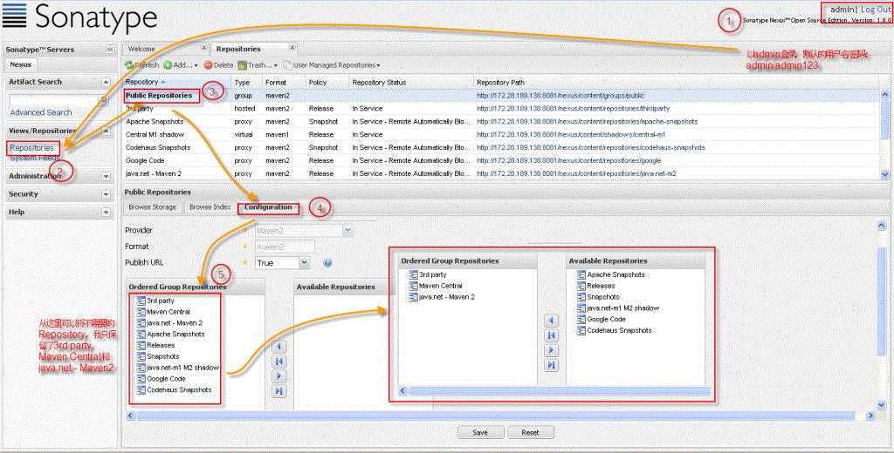
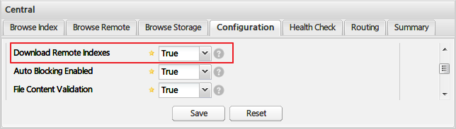
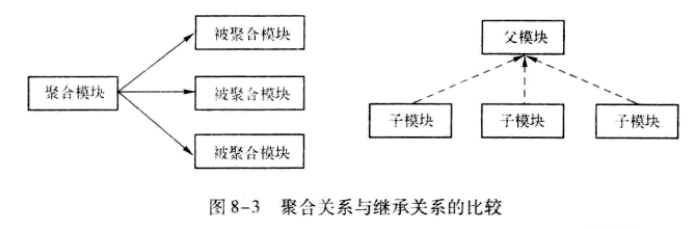

*Apache Maven 3.5.2*

Maven是一个项目管理工具。

当执行Maven构建时，Maven会根据POM中的定义，自动下载相关依赖和插件。

# 安装和配置

## 安装

1. 安装JDK；
2. 下载并解压Maven；
3. 将环境变量`M2_HOME`设置为Maven的安装目录；
4. 将`M2_HOME/bin`目录添加到`Path`环境变量中。

## 配置

### 全局配置

全局配置可以在两个地方：

+ 环境变量`MAVEN_OPTS` ；
+ 配置文件`M2_HOME/conf/settings.xml`。

环境变量`MAVEN_OPTS`通常用于设置一些用于启动JVM的参数，例如：`-Xms256m -Xmx1024m`（用于避免在较大项目中，需要大量内存，而造成的`java.lang.OutOfMemeoryError`错误）。

具体的配置参见：[Maven Local Settings Model Website](http://maven.apache.org/maven-settings/settings.html)

<https://maven.apache.org/xsd/settings-1.0.0.xsd>：

```xml
<settings xmlns="http://maven.apache.org/SETTINGS/1.1.0" 
          xmlns:xsi="http://www.w3.org/2001/XMLSchema-instance"
          xsi:schemaLocation="http://maven.apache.org/SETTINGS/1.1.0 http://maven.apache.org/xsd/settings-1.1.0.xsd">
  <localRepository/>
  <interactiveMode/>
  <usePluginRegistry/>
  <offline/>

  <proxies>
    <proxy>
      <active/>
      <protocol/>
      <username/>
      <password/>
      <port/>
      <host/>
      <nonProxyHosts/>
      <id/>
    </proxy>
  </proxies>

  <servers>
    <server>
      <username/>
      <password/>
      <privateKey/>
      <passphrase/>
      <filePermissions/>
      <directoryPermissions/>
      <configuration/>
      <id/>
    </server>
  </servers>

  <mirrors>
    <mirror>
      <mirrorOf/>
      <name/>
      <url/>
      <layout/>
      <mirrorOfLayouts/>
      <id/>
    </mirror>
  </mirrors>

  <profiles>
    <profile>
      <activation>
        <activeByDefault/>
        <jdk/>
        <os>
          <name/>
          <family/>
          <arch/>
          <version/>
        </os>
        <property>
          <name/>
          <value/>
        </property>
        <file>
          <missing/>
          <exists/>
        </file>
      </activation>
      <properties>
        <key>value</key>
      </properties>

      <repositories>
        <repository>
          <releases>
            <enabled/>
            <updatePolicy/>
            <checksumPolicy/>
          </releases>
          <snapshots>
            <enabled/>
            <updatePolicy/>
            <checksumPolicy/>
          </snapshots>
          <id/>
          <name/>
          <url/>
          <layout/>
        </repository>
      </repositories>
      <pluginRepositories>
        <pluginRepository>
          <releases>
            <enabled/>
            <updatePolicy/>
            <checksumPolicy/>
          </releases>
          <snapshots>
            <enabled/>
            <updatePolicy/>
            <checksumPolicy/>
          </snapshots>
          <id/>
          <name/>
          <url/>
          <layout/>
        </pluginRepository>
      </pluginRepositories>
      <id/>
    </profile>
  </profiles>

  <activeProfiles/>
  <pluginGroups/>
</settings>
```


### 用户级的配置

用户级的配置文件位于：`~/.m2/settings.xml`，它只对当前用户有效果。它的配置内容与全局配置相同。

### 项目级的配置

项目级的配置文件位于项目根目录下的`.mvn`目录中的`maven.config`和`extensions.xml`。


# 入门

## 生成项目

```bash
mvn archetype:generate -DgroupId=com.mycompany.app -DartifactId=my-app -DarchetypeArtifactId=maven-archetype-quickstart -DinteractiveMode=false
```

如果是使用Powershell，要记得给形如“-Dxxx”的参数加上引号：

```powershell
mvn archetype:generate '-DgroupId=com.mycompany.app' '-DartifactId=my-app2' '-DarchetypeArtifactId=maven-archetype-quickstart' '-DinteractiveMode=false'
```

上面命令，将自动创建一个`my-app`目录，并将它作为项目的根目录。

`archetype`是Maven的**插件**，`generate`是该插件的一个**目标（goal）**。

### Maven标准项目结构

```
my-app
|-- pom.xml
|-- LICENSE  （Project's license）
|-- NOTICE  (Notices and attributions required by libraries that the project depends on)
|-- README.md  （Project's readme）
|-- src
|   |-- main
|   |   |-- java  （Application/Library sources）
|   |   |   `-- com
|   |   |       `-- mycompany
|   |   |           `-- app
|   |   |               `-- App.java
|   |   |-- resources  （Application/Library resources） 
|   |   |-- filters  （Resource filter files）
|   |   |-- webapp  （Web application sources）
|   |-- test
|   |   |-- java  （Test sources）
|   |   |   `-- com
|   |   |       `-- mycompany
|   |   |           `-- app
|   |   |               `-- AppTest.java
|   |   |-- resources  （Test resources）
|   |   |-- filters  （Test resource filter files）
|   |-- it （Integration Tests (primarily for plugins)）
|   |-- assembly  （Assembly descriptors）
|   |-- site  （Site）
|-- target  （Output of the build）
```

在一个Maven项目，只有`pom.xml`是必须的，其他内容都是可选的。

## 配置POM

pom.xml：

```xml
<project xmlns="http://maven.apache.org/POM/4.0.0" xmlns:xsi="http://www.w3.org/2001/XMLSchema-instance"
  xsi:schemaLocation="http://maven.apache.org/POM/4.0.0 http://maven.apache.org/xsd/maven-4.0.0.xsd">
  <modelVersion>4.0.0</modelVersion>
 
  <groupId>com.mycompany.app</groupId>
  <artifactId>my-app</artifactId>
  <version>1.0-SNAPSHOT</version>
  <packaging>jar</packaging>
 
  <name>Maven Quick Start Archetype</name>
  <url>http://maven.apache.org</url>
 
  <dependencies>
    <dependency>
      <groupId>junit</groupId>
      <artifactId>junit</artifactId>
      <version>4.12</version>
      <scope>test</scope>
    </dependency>
  </dependencies>
</project>
```

## 编写代码

略。

## 构建项目

```bash
cd my-app
mvn package
```

这里`package`是Maven的一个**阶段（phase）**。阶段是**构建生成周期（build lifecycle）**的一个步骤，而构建生命周期则是多个阶段组成的有序序列。

当执行一个阶段时，Maven将依次执行该阶段之前的所有阶段，然后再执行该阶段。

> 在`mvn`之后，形如“xxx:xxx”的是目标，而只有一个单词的是阶段。
>
> 在同一条mvn命令中，可以同时包含多个目标和阶段：
>
> ```bash
> mvn clean dependency:copy-dependencies package
> ```

常用构建命令：

+ `mvn compile`：仅编译项目，但不打包；
+ `mvn test`：运行单元测试；
+ `mvn test-compile`：仅编译单元测试代码；
+ `mvn package`：编译、测试并打包项目；
+ `mvn install`：打包项目并将它安装到本地仓库；
+ `mvn clean`：清理构建，即删除`target`目录。

## 运行应用

```bash
java -cp target/my-app-1.0-SNAPSHOT.jar com.mycompany.app.App
```

## 生成项目站点

```bash
mvn site
```

生成的项目站点在`target/site`目录下。

# 项目对象模型（POM）

POM定义了项目的基本信息，它描述项目是如何构建，声明了项目依赖等等。

POM通常定义在项目根目录下的`pom.xml`文件中。

## POM的结构

```xml
<project xmlns="http://maven.apache.org/POM/4.0.0"
  xmlns:xsi="http://www.w3.org/2001/XMLSchema-instance"
  xsi:schemaLocation="http://maven.apache.org/POM/4.0.0
                      http://maven.apache.org/xsd/maven-4.0.0.xsd">
  <modelVersion>4.0.0</modelVersion>
 
  <!-- The Basics -->
  <groupId>...</groupId>
  <artifactId>...</artifactId>
  <version>...</version>
  <packaging>...</packaging>
  <dependencies>...</dependencies>
  <parent>...</parent>
  <dependencyManagement>...</dependencyManagement>
  <modules>...</modules>
  <properties>...</properties>
 
  <!-- Build Settings -->
  <build>...</build>
  <reporting>...</reporting>
 
  <!-- More Project Information -->
  <name>...</name>
  <description>...</description>
  <url>...</url>
  <inceptionYear>...</inceptionYear>
  <licenses>...</licenses>
  <organization>...</organization>
  <developers>...</developers>
  <contributors>...</contributors>
 
  <!-- Environment Settings -->
  <issueManagement>...</issueManagement>
  <ciManagement>...</ciManagement>
  <mailingLists>...</mailingLists>
  <scm>...</scm>
  <prerequisites>...</prerequisites>
  <repositories>...</repositories>
  <pluginRepositories>...</pluginRepositories>
  <distributionManagement>...</distributionManagement>
  <profiles>...</profiles>
</project>
```

> POM的详细说明参见官网的 [POM Reference](http://maven.apache.org/pom.html) 。

## Super POM

*Super POM*是Maven的默认POM。所有POM都自动继承自Super POM，除非显式指定父POM。

每个版本的Maven的Super POM可能都有点不一样，具体参见官网。例如：[Maven 3.5.2 的Super POM](http://maven.apache.org/ref/3-LATEST/maven-model-builder/super-pom.html#)：

```xml
<project>
  <modelVersion>4.0.0</modelVersion>

  <repositories>
    <repository>
      <id>central</id>
      <name>Central Repository</name>
      <url>https://repo.maven.apache.org/maven2</url>
      <layout>default</layout>
      <snapshots>
        <enabled>false</enabled>
      </snapshots>
    </repository>
  </repositories>

  <pluginRepositories>
    <pluginRepository>
      <id>central</id>
      <name>Central Repository</name>
      <url>https://repo.maven.apache.org/maven2</url>
      <layout>default</layout>
      <snapshots>
        <enabled>false</enabled>
      </snapshots>
      <releases>
        <updatePolicy>never</updatePolicy>
      </releases>
    </pluginRepository>
  </pluginRepositories>

  <build>
    <directory>${project.basedir}/target</directory>
    <outputDirectory>${project.build.directory}/classes</outputDirectory>
    <finalName>${project.artifactId}-${project.version}</finalName>
    <testOutputDirectory>${project.build.directory}/test-classes</testOutputDirectory>
    <sourceDirectory>${project.basedir}/src/main/java</sourceDirectory>
    <scriptSourceDirectory>${project.basedir}/src/main/scripts</scriptSourceDirectory>
    <testSourceDirectory>${project.basedir}/src/test/java</testSourceDirectory>
    <resources>
      <resource>
        <directory>${project.basedir}/src/main/resources</directory>
      </resource>
    </resources>
    <testResources>
      <testResource>
        <directory>${project.basedir}/src/test/resources</directory>
      </testResource>
    </testResources>
    <pluginManagement>
      <!-- NOTE: These plugins will be removed from future versions of the super POM -->
      <!-- They are kept for the moment as they are very unlikely to conflict with lifecycle mappings (MNG-4453) -->
      <plugins>
        <plugin>
          <artifactId>maven-antrun-plugin</artifactId>
          <version>1.3</version>
        </plugin>
        <plugin>
          <artifactId>maven-assembly-plugin</artifactId>
          <version>2.2-beta-5</version>
        </plugin>
        <plugin>
          <artifactId>maven-dependency-plugin</artifactId>
          <version>2.8</version>
        </plugin>
        <plugin>
          <artifactId>maven-release-plugin</artifactId>
          <version>2.3.2</version>
        </plugin>
      </plugins>
    </pluginManagement>
  </build>

  <reporting>
    <outputDirectory>${project.build.directory}/site</outputDirectory>
  </reporting>

  <profiles>
    <!-- NOTE: The release profile will be removed from future versions of the super POM -->
    <profile>
      <id>release-profile</id>

      <activation>
        <property>
          <name>performRelease</name>
          <value>true</value>
        </property>
      </activation>

      <build>
        <plugins>
          <plugin>
            <inherited>true</inherited>
            <artifactId>maven-source-plugin</artifactId>
            <executions>
              <execution>
                <id>attach-sources</id>
                <goals>
                  <goal>jar</goal>
                </goals>
              </execution>
            </executions>
          </plugin>
          <plugin>
            <inherited>true</inherited>
            <artifactId>maven-javadoc-plugin</artifactId>
            <executions>
              <execution>
                <id>attach-javadocs</id>
                <goals>
                  <goal>jar</goal>
                </goals>
              </execution>
            </executions>
          </plugin>
          <plugin>
            <inherited>true</inherited>
            <artifactId>maven-deploy-plugin</artifactId>
            <configuration>
              <updateReleaseInfo>true</updateReleaseInfo>
            </configuration>
          </plugin>
        </plugins>
      </build>
    </profile>
  </profiles>
</project>
```

> Super POM包含在`$M2_HOME/lib/maven-model-builder-x.x.jar`的`org/apache/maven/model/pom-4.0.0.xml`中。

## 最小的POM

```xml
<project xmlns="http://maven.apache.org/POM/4.0.0"
  xmlns:xsi="http://www.w3.org/2001/XMLSchema-instance"
  xsi:schemaLocation="http://maven.apache.org/POM/4.0.0
                      http://maven.apache.org/xsd/maven-4.0.0.xsd">
  <modelVersion>4.0.0</modelVersion>
 
  <groupId>org.codehaus.mojo</groupId>
  <artifactId>my-project</artifactId>
  <version>1.0</version>
</project>
```

## Maven坐标

POM中的`groupId`、`artifactId`、`version`、`packaging`（可选）和`classifier`（可选）五个元素构成了所谓的**Maven坐标**——它唯一定位一个Maven项目。

Maven坐标在控制台输出时，常写作如下形式：

+ groupId:artifactId:version
+ groupId:artifactId:packaging:version
+ groupId:artifactId:packaging:classifier:version


## 查看生效的POM

```bash
$ mvn help:effective-pom -P appserverConfig-dev
```


# 依赖管理

在`pom.xml`的`dependencies`元素中可以定义项目需要的所有依赖。当Maven开始构建时，它会自动安装这些依赖。Maven首先会去本地仓库中查找这些依赖并构建到项目中，如果本地仓库中没有找到，则会从配置的远程仓库中下载到本地仓库，然后再构建到项目中。

# 构建项目

## 构建生命周期

构建生命周期由构建阶段组成，它定义了一个项目在构建过程中经历的步骤。而构建阶段是由插件目标组成的（插件目标通过绑定到构建阶段，而构建阶段关联）。

> 有些构建阶段，它们的名字是由连字符分隔的复合单词（例如：`pre-*`、`post-*`、`process-*`等等），它们通常不应该在命令行中直接调用。因为，它们要么产生对我们没用的中间结果，要么只是做了一些准备工作（例如：启动Tomcat）。直接调用这些阶段将导致某些被启动的服务没办法正常关闭。

Maven中有三个内置的构建生命周期：default、clean和site。

### Clean生命周期

| `pre-clean`  | execute processes needed prior to the actual project cleaning |
| ------------ | ------------------------------------------------------------ |
| `clean`      | remove all files generated by the previous build             |
| `post-clean` | execute processes needed to finalize the project cleaning    |

### 默认生命周期

| `validate`                | validate the project is correct and all necessary information is available. |
| ------------------------- | ------------------------------------------------------------ |
| `initialize`              | initialize build state, e.g. set properties or create directories. |
| `generate-sources`        | generate any source code for inclusion in compilation.       |
| `process-sources`         | process the source code, for example to filter any values.   |
| `generate-resources`      | generate resources for inclusion in the package.             |
| `process-resources`       | copy and process the resources into the destination directory, ready for packaging. |
| `compile`                 | compile the source code of the project.                      |
| `process-classes`         | post-process the generated files from compilation, for example to do bytecode enhancement on Java classes. |
| `generate-test-sources`   | generate any test source code for inclusion in compilation.  |
| `process-test-sources`    | process the test source code, for example to filter any values. |
| `generate-test-resources` | create resources for testing.                                |
| `process-test-resources`  | copy and process the resources into the test destination directory. |
| `test-compile`            | compile the test source code into the test destination directory |
| `process-test-classes`    | post-process the generated files from test compilation, for example to do bytecode enhancement on Java classes. For Maven 2.0.5 and above. |
| `test`                    | run tests using a suitable unit testing framework. These tests should not require the code be packaged or deployed. |
| `prepare-package`         | perform any operations necessary to prepare a package before the actual packaging. This often results in an unpacked, processed version of the package. (Maven 2.1 and above) |
| `package`                 | take the compiled code and package it in its distributable format, such as a JAR. |
| `pre-integration-test`    | perform actions required before integration tests are executed. This may involve things such as setting up the required environment. |
| `integration-test`        | process and deploy the package if necessary into an environment where integration tests can be run. |
| `post-integration-test`   | perform actions required after integration tests have been executed. This may including cleaning up the environment. |
| `verify`                  | run any checks to verify the package is valid and meets quality criteria. |
| `install`                 | install the package into the local repository, for use as a dependency in other projects locally. |
| `deploy`                  | done in an integration or release environment, copies the final package to the remote repository for sharing with other developers and projects. |

### Site生命周期

| `pre-site`    | execute processes needed prior to the actual project site generation |
| ------------- | ------------------------------------------------------------ |
| `site`        | generate the project's site documentation                    |
| `post-site`   | execute processes needed to finalize the site generation, and to prepare for site deployment |
| `site-deploy` | deploy the generated site documentation to the specified web server |

### 内置的生命周期绑定

#### Clean生命周期绑定

| `clean` | `clean:clean` |
| ------- | ------------- |
|         |               |

####  `packaging`是`ejb`、`ejb3`、`jar`、`par`、`rar`、`war`的默认生命周期绑定

| `process-resources`      | `resources:resources`                                        |
| ------------------------ | ------------------------------------------------------------ |
| `compile`                | `compiler:compile`                                           |
| `process-test-resources` | `resources:testResources`                                    |
| `test-compile`           | `compiler:testCompile`                                       |
| `test`                   | `surefire:test`                                              |
| `package`                | `ejb:ejb` *or* `ejb3:ejb3` *or* `jar:jar` *or* `par:par` *or* `rar:rar` *or* `war:war` |
| `install`                | `install:install`                                            |
| `deploy`                 | `deploy:deploy`                                              |

#### `packaging`是`ear`的默认生命周期绑定

| `generate-resources` | `ear:generate-application-xml` |
| -------------------- | ------------------------------ |
| `process-resources`  | `resources:resources`          |
| `package`            | `ear:ear`                      |
| `install`            | `install:install`              |
| `deploy`             | `deploy:deploy`                |

#### `packaging`是`maven-plugin`的默认生命周期绑定

| `generate-resources`     | `plugin:descriptor`                                |
| ------------------------ | -------------------------------------------------- |
| `process-resources`      | `resources:resources`                              |
| `compile`                | `compiler:compile`                                 |
| `process-test-resources` | `resources:testResources`                          |
| `test-compile`           | `compiler:testCompile`                             |
| `test`                   | `surefire:test`                                    |
| `package`                | `jar:jar` *and* `plugin:addPluginArtifactMetadata` |
| `install`                | `install:install`                                  |
| `deploy`                 | `deploy:deploy`                                    |

#### `packaging`是`pom`的默认生命周期绑定

| `package` | `site:attach-descriptor` |
| --------- | ------------------------ |
| `install` | `install:install`        |
| `deploy`  | `deploy:deploy`          |

#### Site生命周期绑定

| `site`        | `site:site`   |
| ------------- | ------------- |
| `site-deploy` | `site:deploy` |

### 自定义的生命周期绑定

可以在POM中显式设置插件目标与构建阶段的绑定：

```xml
...
 <plugin>
   <groupId>com.mycompany.example</groupId>
   <artifactId>display-maven-plugin</artifactId>
   <version>1.0</version>
   <executions>
     <execution>
       <phase>process-test-resources</phase>
       <goals>
         <goal>time</goal>
       </goals>
     </execution>
   </executions>
 </plugin>
...
```


## 打包方式

要对Maven项目打包，只需要执行下列Maven命令：

```bash
mvn package
```

打包方式由`packaging`设置，它当前内置的类型有：`jar`（默认值）、`pom`、 `maven-plugin`、`ejb`、`war`、`ear`、`rar`、`par` 。

除了内置的类型，还可以启用其他的一些packaging类型（例如：`plexus-application`）。这需要

在POM中添加相应的插件（例如：Plexus插件），并且设置它的`<extensions>true</extensions>`。

## 离线构建

如果需要在临时断开网络的情况下构建项目，可以使用`-o`参数：

```bash
$ mvn -o package
```

在离线构建下，许多插件将不会执行那些需要连接网络的操作。

# 插件

插件的主要作用就是为Maven提供插件目标。

## 插件目标

插件目标代表一个具体的任务，它可以绑定到0个或任意多个构建阶段。

没有与任何构建阶段绑定的插件目标，不属于任何构建生命周期，它们通常作为一个任务，通过Maven命令直接执行。

当在一个项目中执行一个构建阶段时，其实是执行这个项目包含的插件（有些默认包含的插件是由`packaging`的设置决定的）中，与该构建阶段及在它之前的阶段绑定的插件目标。

当多个插件目标绑定到同一个构建阶段时，它们的执行顺序是：首先执行与`packaging`相关的内置绑定目标，然后再按在POM中定义的插件的先后顺序依次执行对应目标。另外，可以使用`executions`元素来获得目标执行顺序的更多控制权。

# Maven仓库

## 本地仓库

本地仓库主要作用是缓存从远程仓库中下载的依赖和、插件等，以及还没有发布的一些临时构建工件。

Maven在构建项目时，首先会去本地仓库中查找依赖和插件，只有在本地仓库找不到所需要的依赖和插件时，才会去远程仓库中，将所需要的依赖和插件下载到本地仓库，然后再构建到工件中。

### 配置本地仓库

本地仓库默认的位置是`~/.m2/repository/`。

如果想将本地仓库放在其他地方，可以在`pom.xml`中进行如下配置：

```xml
<settings>
  ...
  <localRepository>/path/to/local/repo/</localRepository>
  ...
</settings>
```

### 安装JARs到本地仓库

```bash
$ mvn install:install-file -Dfile=<path-to-file> -DgroupId=<group-id> \
    -DartifactId=<artifact-id> -Dversion=<version> -Dpackaging=<packaging>
```

使用上面命令，JARs可以不是使用Maven构建的。

如果有该JARs的`pom.xml`，则只需要：

```bash
$ mvn install:install-file -Dfile=<path-to-file> -DpomFile=<path-to-pomfile>
```

从2.5版本开始，如果JARs是使用Maven构建的，它将在`META-INF`的子目录中包含`pom.xml`，则只需要：

```bash
$ mvn install:install-file -Dfile=<path-to-file>
```

如果Maven项目还没打包成JARs，则只需要在项目根目录下（包含`pom.xml`）执行：

```bash
$ mvn install
```


## 远程仓库

### 中央仓库

中央仓库是在Super POM中配置的默认远程仓库。

### 其他远程仓库

其他远程仓库包括许多第三方的远程仓库，也包括自己搭建的私有仓库。要使用这些远程仓库，可在`pom.xml`中配置：

```xml
<project>
  ...
  <repositories>
    <repository>
      <id>maven2-repository.dev.java.net</id>
      <name>Java.net Repository for Maven</name>
      <url>http://download.java.net/maven/2/</url>
      <releases>
      	<enabled>true</enabled>
      </releases>
      <snapshots>
      	<enabled>true</enabled>
        <updatePolicy>daily</updatePolicy>
        <checksumPolicy>ignore</checksumPolicy>
      </snapshots>
      <layout>default</layout>
    </repository>
  </repositories>
  ...
</project>
```

`updatePolicy`用来Maven从远程仓库检查更新的频率，默认值是`daily`，表示Maven每天检查一次。其它可用的选项包括：`never`——从不检查更新；`always`——每次构建都检查更新；`interval`——每隔X（任意整数）分钟检查一次更新。

`checksumPolicy`用来配置Maven检查校验和文件的策略。当工件部署到Maven仓库中时，会同时部署对应的校验和文件 。在下载工件时，Maven会验证校验和文件。`checksumPolicy`的值默认是`warn`，表示当验证失败时输出警告信息。其他可用的选项包括：`fail`——验证失败就让构建失败；`ignore`——忽略验证失败。

`layout`的值为`default`，表示仓库的布局是Maven2和Maven3的默认布局，而不是Maven1的布局。

大部分远程仓库无须认证就可以访问，但有时候出于安全方面 的考虑，需要提供认证信息才能访问一些远程仓库。远程仓库的认证信息配置在`settings.xml`的`servers`中，具体参见：部署JARs到远程仓库。

### 使用镜像仓库

如果仓库X可以提供仓库Y存储的所有内容，那么就可以认为X是Y的一个镜像。

如果中央仓库比较慢，则可以选择相对较快的其他镜像仓库来代替。只要在`settings.xml`中配置这些镜像仓库：

```xml
<settings>
  ...
  <mirrors>
    <mirror>
      <id>UK</id>  <!--镜像ID，可以随便取，但必须是唯一的-->
      <name>UK Central</name>
      <url>http://uk.maven.org/maven2</url>  <!--镜像仓库的URL-->
      <mirrorOf>central</mirrorOf>  <!--被镜像的仓库ID-->
    </mirror>
  </mirrors>
  ...
</settings>
```

`mirrorOf`用来指定该镜像仓库是用于作为哪个仓库的镜像使用。这里，`central`是中央仓库的ID。因此，这里ID为`UK`的仓库被配置为中央仓库的镜像，任何对于中央仓库的请求都会转到该镜像。

对于一个远程仓库，最多只能配置一个镜像仓库。但是多个远程仓库可以配置同一个镜像仓库。

`mirrorOf`还可以取如下值：

- `<mirrorOf>*</mirrorOf>`：作为所有远程仓库的镜像仓库；
- `<mirrorOf>external:*</mirrorOf>`：作为所有远程仓库的镜像仓库，但不包括基于`localhost`或`file`的仓库 ；
- `<mirrorOf>repo1,repo2,…</mirrorOf>`：作为`repo1`、`repo2`、……的镜像仓库；
- `<mirrorOf>*,!repo1</mirrorOf>`：作为除了`repo1`以外的仓库的镜像仓库；
- `<mirrorOf>external:*,!repo1</mirrorOf>`。

### 搭建自己的私有仓库

私有仓库是架设在局域网的一种特殊的远程仓库，目的是代理远程仓库及部署第三方构件。有了私有仓库之后，当 Maven 需要下载构件时，直接请求私有仓库，私有仓库上存在则下载到本地仓库；否则，私有仓库请求外部的远程仓库，将构件下载到私有仓库，再提供给本地仓库下载。





我们可以使用专门的 Maven 仓库管理软件来搭建私服，比如：[Apache Archiva](http://archiva.apache.org/index.cgi)，[Artifactory](http://www.jfrog.com/home/v_artifactory_opensource_overview/)，[Sonatype Nexus](http://www.sonatype.org/nexus/)。这里我们使用 Sonatype Nexus。

#### 安装Nexus

Nexus的Bundle自带了Jetty容器，因此用户不需要额外的Web容器就能直接启动Nexus。

下载Bundle包，例如：`nexus-3.8.0-02-unix.tar.gz`，并解压。

解压后会在同级目录中，出现两个文件夹：`nexus-3.8.0-02`和`sonatype-work`，前者包含了nexus的运行环境和应用程序，后者包含了你自己的配置和数据。

Unix/Linux下启动Nexus：

```bash
$ cd nexus-3.8.0-02/bin
$ ./nexus run
```

Windows下启动Nexus：

```powershell
> cd nexus-3.8.0-02\bin
> .\nexus.exe /run
```

打开<http://localhost:8081/nexus/>就可以看到登录界面了。

点击右上角 Log In，使用用户名：admin ，密码：admin123 登录。

要停止Nexus，只要按`Ctrl-C`键。

>  另外，现在更简单的安装Nexus，是通过 Docker方式安装。

#### 配置仓库

**Nexus 的仓库分为这么几类：**

- hosted 宿主仓库：主要用于部署无法从公共仓库获取的构件（如 oracle 的 JDBC 驱动）以及自己或第三方的项目构件；
- proxy 代理仓库：代理公共的远程仓库；
- virtual 虚拟仓库：用于适配 Maven 1；
- group 仓库组：Nexus 通过仓库组的概念统一管理多个仓库，这样我们在项目中直接请求仓库组即可请求到仓库组管理的多个仓库。



默认Nexus已经预设了一些仓库。我们要做的只是配置一个预设的Public Repositories仓库组，该仓库组既可以包含一些第三方远程仓库，也可以包含自己的私有仓库。后面引用私有仓库时实际上是引用这个仓库组：



> `Ordered Group Repositories`是仓库组当前拥有的仓库。

为了更好的使用 Nexus 的搜索，我们可以设置所有 proxy 仓库的 `Download Remote Indexes` 为 `true`，即允许下载远程仓库索引：



#### 使用私有仓库

方法一、在项目的`pom.xml`中配置`repositories`。（只对当前项目有效）：

```xml
<repositories>  
  <repository>  
    <snapshots>  
      <enabled>true</enabled>  
    </snapshots>  
    <id>public</id>  
    <name>Public Repositories</name>  
    <url>http://172.28.189.138:8081/nexus/content/groups/public/</url>  
  </repository>  
</repositories>  
<pluginRepositories>  
  <pluginRepository>  
    <id>public</id>  
    <name>Public Repositories</name>  
    <url>http://172.28.189.138:8081/nexus/content/groups/public/</url>  
  </pluginRepository>  
</pluginRepositories>  
```

方法二、在`settings.xml`中将私有仓库配置为所有远程仓库的镜像仓库。（对本机所有Maven项目有效）：

```xml
<settings xmlns="http://maven.apache.org/SETTINGS/1.1.0"     
          xmlns:xsi="http://www.w3.org/2001/XMLSchema-instance"
          xsi:schemaLocation="http://maven.apache.org/SETTINGS/1.1.0 http://maven.apache.org/xsd/settings-1.1.0.xsd">
  ...
  <mirrors>
    <mirror>
      <id>nexus</id>
      <mirrorOf>*</mirrorOf>    
      <url>http://192.168.0.110:8081/nexus/content/groups/public/</url>
    </mirror>    
  </mirrors> 
 
  <profiles>
    <profile>
      <id>nexus</id>
      <repositories>
        <repository>
          <id>nexus</id>
          <name>Nexus</name>
          <url>http://192.168.0.110:8081/nexus/content/groups/public/</url>
          <releases><enabled>true</enabled></releases>
          <snapshots><enabled>true</enabled></snapshots>
        </repository>
      </repositories>
      <pluginRepositories>
        <pluginRepository>
          <id>nexus</id>
            <name>Nexus</name>
            <url>http://192.168.0.110:8081/nexus/content/groups/public/</url>
            <releases><enabled>true</enabled></releases>
            <snapshots><enabled>true</enabled></snapshots>
        </pluginRepository>
      </pluginRepositories>
    </profile>
  </profiles>
  <activeProfiles>
    <activeProfile>nexus</activeProfile>
  </activeProfiles>
  ...
</settings>
```

> 由于`settings.xml`不支持直接配置`repositories`和`pluginRepositories`，因此只能放在`profiles`中配置。

如果要将工件发布到私有仓库，参见下一节：部署JARs到远程仓库。

### 部署JARs到远程仓库

首先，在`pom.xml`中配置目标远程仓库的URL：

```xml
<project>
  ……
  <distributionManagement>
    <repository>
      <id>mycompany-releases</id>  <!--要与settings.xml中配置的servier id一gcft-->
      <name>MyCompany Releases Repository</name>
      <url>http://192.168.1.103:8081/nexus/content/repositories/releases/</url>
    </repository>
    <snapshotRepository>
      <id>mycompany-snapshots</id>
      <name>MyCompany Snapshots Repository</name>
      <url>http://192.168.1.103:8081/nexus/content/repositories/snapshots/</url>
    </snapshotRepository>
  </distributionManagement>
  ……
</project>
```

如果是部署第三方JARs，则上面配置可忽略。

然后，在配置文件`settings.xml`中配置连接远程仓库的认证信息：

```xml
<settings xmlns="http://maven.apache.org/SETTINGS/1.0.0"
  xmlns:xsi="http://www.w3.org/2001/XMLSchema-instance"
  xsi:schemaLocation="http://maven.apache.org/SETTINGS/1.0.0
                      http://maven.apache.org/xsd/settings-1.0.0.xsd">
  ...
  <servers>
    <server>
      <id>mycompany-releases</id>
      <username>jvanzyl</username>
      <!-- Default value is ~/.ssh/id_dsa -->
      <privateKey>/path/to/identity</privateKey> (default is ~/.ssh/id_dsa)
      <passphrase>my_key_passphrase</passphrase>
    </server>
    <server>
    	<id>mycompany-snapshots</id>
      <username>admin</username>
      <password>admin123</password>  <!--直接使用密码-->
    </server>
    ...
  </servers>
  ...
</settings>
```

最后，运行下列命令之一去部署JARs到远程仓库：

如果Maven项目还没有打成JARs，则只需要在项目根目录下（包含`pom.xml`）执行：

```bash
mvn deploy
```

如果Maven项目已经打成JARs，并且可以获得它的`pom.xml`，则：

```bash
mvn deploy:deploy-file -DpomFile=<path-to-pom> \
  -Dfile=<path-to-file> \
  -DrepositoryId=<id-to-map-on-server-section-of-settings.xml> \
  -Durl=<url-of-the-repository-to-deploy>
```

如果是部署第三方JARs（可能不是Maven构建），则：

```bash
mvn deploy:deploy-file -DgroupId=<group-id> \
  -DartifactId=<artifact-id> \
  -Dversion=<version> \
  -Dpackaging=<type-of-packaging> \
  -Dfile=<path-to-file> \
  -DrepositoryId=<id-to-map-on-server-section-of-settings.xml> \
  -Durl=<url-of-the-repository-to-deploy>
```

默认情况，`deploy:deploy-file会生成一个通用的`pom.xml`，随同该JARs一起部署到远程仓库。如果要禁用这个行为，则需要加上`-DgeneratePom=false`参数。

另外，如果只是部署源代码，则`-Dpackaging=java-source`，并且`-DgeneratePom=false`。

默认情况下，不允许重新发布同一版本的工件，需要登陆nexus将原来发布删除，再重新发布。但是，如果将仓库的`Deployment Policy`设置成`Allow Redeploy`，则重新发布会自动覆盖原发布。

# 属性和插值

在`pom.xml`中，允许使用插值——`${属性名}`。

插值中的属性来自：

- `pom.xml`和`settings.xml`的单值元素；

- 一些特殊属性：

  | `project.basedir`       | The directory that the current project resides in.           |
  | ----------------------- | ------------------------------------------------------------ |
  | `project.baseUri`       | The directory that the current project resides in, represented as an URI. *Since Maven 2.1.0* |
  | `maven.build.timestamp` | The timestamp that denotes the start of the build. *Since Maven 2.1.0-M1* |

  `maven.build.timestamp`的格式可以通过定义一个`maven.build.timestamp.format`来自定义：

  ```xml
  <project>
    ...
    <properties>
      <maven.build.timestamp.format>yyyy-MM-dd'T'HH:mm:ss'Z'</maven.build.timestamp.format>
    </properties>
    ...
  </project>
  ```

  该格式的模式请参照`java.text.SimpleDateFormat`的模式。

- `pom.xml`的`properties`中定义的属性：

  ```xml
  <project>
    ...
    <properties>
      <mavenVersion>2.1</mavenVersion>
    </properties>
    <dependencies>
      <dependency>
        <groupId>org.apache.maven</groupId>
        <artifactId>maven-artifact</artifactId>
        <version>${mavenVersion}</version>
      </dependency>
      <dependency>
        <groupId>org.apache.maven</groupId>
        <artifactId>maven-project</artifactId>
        <version>${mavenVersion}</version>
      </dependency>
    </dependencies>
    ...
  </project>
  ```

  ​

# 资源

在默认情况下，目录`${basedir}/src/main/resources`用于放置资源文件、配置文件等，它们在打包时，将原样打包进JAR或WAR中。

同样，目录`${basedir}/src/test/resources`用于放置测试用的资源。

## 过滤资源

过滤的资源文件中允许通过插值方式——`${属性名}`，访问构建时的属性。

例如：为了将`resources`目录下的资源文件变成过滤资源，只需在`pom.xml`中将相应资源的`filtering`设置为`true`就可以：

```xml
<build>
    <resources>
        <resource>
            <directory>src/main/resources</directory>
            <filtering>true</filtering>
        </resource>
    </resources>
</build>
```

这些构建时属性是：

+ `pom.xml`的元素（没有子元素）；
+ `pom.xml`的`properties`中定义的属性；
+ 配置文件`settings.xml`的元素（没有子元素）；
+ 外部的属性文件中定义的属性；
+ 系统属性。

### 引用`pom.xml`和`settings.xml`的单值元素

假设在`resources`目录下有一个`app.properties`文件，则可以在该文件中访问一些属性：

```properties
# 访问 pom.xml 中的元素值
app.name=${project.name}  # 或者 ${pom.name}
app.finalName=${project.build.finalName}

# 访问 settings.xml 中的元素值
localRepo=${settings.localRepository}
```

你可以运行下列阶段命令：

```bash
mvn process-resources
```

则在`target/classes`目录下就可以看到过滤后的效果：

```properties
# 访问 pom.xml 中的属性
app.name=my-app  # 或者 ${pom.name}
app.finalName=my-app-1.0-SNAPSHOT

# 访问 settings.xml 中的属性
localRepo=/home/i/.m2/repository
```

> `finalName`的默认值是`${project.name}-${project.version}`。

### 引用外部属性文件中定义的属性

如果要引用外部属性文件中的属性，还需要在`pom.xml`中`filter`元素中指定外部属性文件的路径：

`pom.xml`：

```xml
<build>
    <filters>
        <filter>src/main/filters/filter.properties</filter>
    </filters>
    <resources>
        <resource>
            <directory>src/main/resources</directory>
            <filtering>true</filtering>
        </resource>
    </resources>
</build>
```

### 引用`pom.xml`的`properties`中定义的属性

`pom.xml`：

```xml
<project>
  ……
  <build>
    <resources>
      <resource>
        <directory>src/main/resources</directory>
        <filtering>true</filtering>
      </resource>
    </resources>
  </build>
 
  <properties>
    <my.filter.value>hello</my.filter.value>
  </properties>
  ……
</project>
```

`app.properties`：

```properties
# 访问 pom.xml 中的元素值
app.name=${project.name}  # 或者 ${pom.name}
app.finalName=${project.build.finalName}

# 访问 settings.xml 中的元素值
localRepo=${settings.localRepository}

# 访问 properties 中定义的属性
message=${my.filter.value}
```

### 引用系统属性

系统属性有些是内置于java的，有些是通过命令行参数`-Dxxx`传递进来的。

`app.properties`：

```properties
# 访问 pom.xml 中的元素值
app.name=${project.name}  # 或者 ${pom.name}
app.finalName=${project.build.finalName}

# 访问 settings.xml 中的元素值
localRepo=${settings.localRepository}

# 访问 properties 中定义的属性
message=${my.filter.value}

# 访问系统属性
java.version=${java.version}
command.line.prop=${command.line.prop}
```

运行：

```bash
mvn process-resources "-Dcommand.line.prop=hello again"
```

> 过滤资源中无法引用环境变量。

# Profile

profile可以根据需要动态地启用特定配置，从而实现多环境构建的支持。

## Profile的层次

- 项目级的Profiles定义在`pom.xml`中；
- 用户级的Profiles定义在`~/.m2/settings.xml`中；
- 全局的Profiles定义在`${maven.home}/conf/settings.xml`中。

>  `settings.xml`中定义的Profiles优先级高于在`pom.xml`中定义的Profiles。

在`settings.xml`中定义的Profiles只能包含：

-  `<repositories>` 
- `<pluginRepositories>`
- `<properties>` 

在`pom.xml`中定义的Profiles只能包含：

- `<repositories>`
- `<pluginRepositories>`
- `<dependencies>`
- `<plugins>`
- `<properties>` (not actually available in the main POM, but used behind the scenes)
- `<modules>`
- `<reporting>`
- `<dependencyManagement>`
- `<distributionManagement>`
- a subset of the `<build>` element, which consists of：
  - `<defaultGoal>`
  - `<resources>`
  - `<testResources>`
  - `<finalName>`

## 启用/禁用Profile

### 使用命令行启用Profile

在Maven命令中，使用参数`-P profileID1,profileID2,…`可以启用指定Profiles：

```bash
$ mvn package -P profile-1,profile-2
```

这种方式，对于那些依靠激活配置或在`settings.xml`的`<activeProfiles>`中的Profiles没有效果。

### 使用Maven配置启用Profile

在`settings.xml`中，可以通过`<activeProfiles>`来指定要启用的Profiles：

```xml
<settings>
  ...
  <activeProfiles>
    <activeProfile>profile-1</activeProfile>
  </activeProfiles>
  ...
</settings>
```

### 根据指定的构建环境自动启用

当在`<activation>`中指定的构建环境满足时，自动启用该Profile。

#### 基于JDK版本号

```xml
<profiles>
  <profile>
    <activation>
      <jdk>1.4</jdk>
    </activation>
    ...
  </profile>
</profiles>
```

当JDK的版本是“1.4”时，启用该profile。在指定JDK的版本时，可以使用范围：

```xml
<profiles>
  <profile>
    <activation>
      <jdk>[1.3,1.6)</jdk>
    </activation>
    ...
  </profile>
</profiles>
```

当JDK版本大于等于“1.3”，并且小于“1.6”时，启用该profile。

> 注意：`, 1.5]`这样的上界，并不会包含`1.5_05`这样的版本号。

#### 基于操作系统配置

```xml
<profiles>
  <profile>
    <activation>
      <os>
        <name>Windows XP</name>
        <family>Windows</family>
        <arch>x86</arch>
        <version>5.1.2600</version>
      </os>
    </activation>
    ...
  </profile>
</profiles>
```

参见： [Maven Enforcer Plugin](http://maven.apache.org/enforcer/enforcer-rules/requireOS.html) 

#### 基于系统属性

```xml
<profiles>
  <profile>
    <activation>
      <property>
        <name>debug</name>
      </property>
    </activation>
    ...
  </profile>
</profiles>
```

当系统属性`debug`被定义时启用。（`debug`是什么值无所谓）。

如果要表示当系统属性`debug`没有被定义时启用，则使用：

```xml
<profiles>
  <profile>
    <activation>
      <property>
        <name>!debug</name>
      </property>
    </activation>
    ...
  </profile>
</profiles>
```

下列的配置表示 ，当系统属性`debug`没有被定义，或者定义的值不是`true`时启用：

```xml
<profiles>
  <profile>
    <activation>
      <property>
        <name>debug</name>
        <value>!true</value>
      </property>
    </activation>
    ...
  </profile>
</profiles>
```

系统属性可以通过命令行中的`-D`参数来指定：

```bash
mvn install -Ddebug=false
```

#### 基于已启用的Profiles的`<properties>`配置的属性

从Maven 3.0开始，在`settings.xml`中，通过`<activation>`启用的Profiles，它的`<properties>`配置的属性，也可以用来作为 激活其他Profile的条件。

#### 基于环境变量

```xml
<profiles>
  <profile>
    <activation>
      <property>
        <name>env.FOO</name>
        <value>bar</value>
      </property>
    </activation>
    ...
  </profile>
</profiles>
```

环境变量`FOO`在配置中，要写成`env.FOO`。并且，在Windows中，环境变量名的所有字母要使用大写形式。

#### 基于某个文件是否存在

```xml
<profiles>
  <profile>
    <activation>
      <file>
        <missing>target/generated-sources/axistools/wsdl2java/org/apache/maven</missing>
      </file>
    </activation>
    ...
  </profile>
</profiles>
```

`<missing>`表示不存在某个文件时，`exists`表示存在某个文件时。这两个元素都支持使用插值，但插值中只允许系统变量和环境变量（例如：`${env.HOME}`）。

### 默认启用

```xml
<profiles>
  <profile>
    <id>profile-1</id>
    <activation>
      <activeByDefault>true</activeByDefault>
    </activation>
    ...
  </profile>
</profiles>
```

如果没有其他Profile被启用，则这个Profile将自动启用。只要有其他Profile被启用，默认启用的Profile将被自动禁用。

### 禁用Profile

从Maven 2.0.10开始，在Maven命令中通过在Profile ID的前面加上`!`或`-`前缀，将禁用该Profile：

```bash
$ mvn groupId:artifactId:goal -P !profile-1,!profile-2
```

这条命令能禁用以任何方式启用的Profile，包括`activeByDefault`方式。

### 查看当前已启用的Profile

```bash
$ mvn help:active-profiles
```


# 多模块项目

## 项目继承

Maven的项目之间可互相继承，子模块的`pom.xml`中没有的元素将从父模块的`pom.xml`中继承下来；而子模块中有的元素，有些会覆盖父模块中同名的元素（例如：`groupId`、`version`等），而有些则会与父模块中同名元素进行合并，例如：

+ dependencies
+ developers and contributors
+ plugin lists (including reports)
+ plugin executions with matching ids
+ plugin configuration
+ resources

Maven的项目继承，各模块之间既可以是嵌套结构的，也可以彼此扁平的。

> 注意：构建父模块并不会构建子模块，反之亦然。

### 嵌套式

项目结构：

```
my-app
  |-- my-module
  |   `-- pom.xml
  `-- pom.xml
```

`my-app/pom.xml`：

```xml
<project>
  <modelVersion>4.0.0</modelVersion>
  <groupId>com.mycompany.app</groupId>
  <artifactId>my-app</artifactId>
  <packaging>pom</packaging>
  <version>1</version>
</project>
```

父模块的`packaging`必须是`pom`。

`my-module/pom.xml`：

```xml
<project>
  <parent>
    <groupId>com.mycompany.app</groupId>
    <artifactId>my-app</artifactId>
    <version>1</version>
  </parent>
  <modelVersion>4.0.0</modelVersion>
  <groupId>com.mycompany.app</groupId>
  <artifactId>my-module</artifactId>
  <version>1</version>
</project>
```

子模块使用`parent`元素来继承指定父模块。

`my-module/pom.xml`中与父模块相同部分可以省略：

```xml
<project>
  <parent>
    <groupId>com.mycompany.app</groupId>
    <artifactId>my-app</artifactId>
    <version>1</version>
  </parent>
  <modelVersion>4.0.0</modelVersion>
  <artifactId>my-module</artifactId>
</project>
```

在构建嵌套式的子模块时，父模块**不需要**事先安装到仓库，也不需要显式使用`relativePath`元素。

### 扁平式

在扁平式的项目继承中，父模块与子模块在位置上是相互独立的，子模块没有嵌套在父模块中。

在使用`parent`来配置父模块时，如果父模块已经事先安装到仓库中，则配置与嵌套式一样；否则，需要使用`relativePath`元素来显式指定父模块的`pom.xml`相对于当前模块的`pom.xml`的位置：

扁平式的项目结构：

```
.
 |-- my-module
 |   `-- pom.xml
 `-- parent
     `-- pom.xml
```

`parent/pom.xml`：

```xml
<project>
  <modelVersion>4.0.0</modelVersion>
  <groupId>com.mycompany.app</groupId>
  <artifactId>my-app</artifactId>
  <packaging>pom</packaging>
  <version>1</version>
</project>
```

父模块的`packaging`必须是`pom`。

`my-module/pom.xml`：

```xml
<project>
  <parent>
    <groupId>com.mycompany.app</groupId>
    <artifactId>my-app</artifactId>
    <version>1</version>
    <relativePath>../parent/pom.xml</relativePath>
  </parent>
  <modelVersion>4.0.0</modelVersion>
  <artifactId>my-module</artifactId>
</project>
```

如果`my-app`模块没有事先安装到仓库，则必须显式设置`relativePath`元素。

> `relativePath`的默认值是`../pom.xml`。

## 项目聚合

### 嵌套式

项目结构：

```
my-app
  |-- my-module
  |   `-- pom.xml
  `-- pom.xml
```

`my-app/pom.xml`：

```xml
<project>
  <modelVersion>4.0.0</modelVersion>
  <groupId>com.mycompany.app</groupId>
  <artifactId>my-app</artifactId>
  <version>1</version>
  <packaging>pom</packaging>
 
  <modules>
    <module>my-module</module>
  </modules>
</project>
```

聚合模块通过`modules`元素来指定各被聚合模块。`module`的值是被聚合模块的路径（相对于聚合模块的路径）。

聚合模块的`packaging`必须是`pom`。

`my-module/pom.xml`：

```xml
<project>
  <modelVersion>4.0.0</modelVersion>
  <groupId>com.mycompany.app</groupId>
  <artifactId>my-module</artifactId>
  <version>1</version>
</project>
```

被聚合模块不需要专门配置。并且，被聚合模块的POM中，与聚合模块相同的部分也不能省略，也不能从聚合模块的POM中继承任何东西。

### 扁平式

扁平式的项目结构：

```
.
 |-- my-module
 |   `-- pom.xml
 `-- aggregation
     `-- pom.xml
```

`aggregation/pom.xml`：

```xml
<project>
  <modelVersion>4.0.0</modelVersion>
  <groupId>com.mycompany.app</groupId>
  <artifactId>my-app</artifactId>
  <version>1</version>
  <packaging>pom</packaging>
 
  <modules>
    <module>../my-module</module>
  </modules>
</project>
```

项目聚合的扁平式与嵌套式实际上是一样的，只不过要注意设置正确被聚合模块的相对路径。

### 聚合项目的构建

在聚合模块上执行的Maven命令，也会自动在所有被聚合模块上执行。反之则不会。

这样，聚合项目就可以只使用一条Maven构建命令，就构建整个聚合项目。例如，只需要在聚合模块中运行如下构建命令，则整个聚合项目都会被构建：

```bash
mvn verify
```

如果在聚合模块中，只希望构建自己，而不希望构建它的被聚合模块，则只需要在运行Maven命令时，加上`--non-recursive`参数：

```bach
mvn verify --non-recursive
```

## 继承和聚合的关系

在多模块Maven项目中，聚合与继承其实是两个不同的概念，其目的完全不同。聚合主要是为了方便快速构建项目，而继承则是为了消除重得配置。

它们的共同特点是，聚合模块和父模块的POM的`packaging`都必须是`pom`。



聚合和继承是可以同时使用的。

混合的项目结构：

```
app
  +- pom.xml
  +- my-app
  | +- pom.xml
  | +- src
  |   +- main
  |     +- java
  +- my-webapp
  | +- pom.xml
  | +- src
  |   +- main
  |     +- webapp
```

父模块要使用`modules`元素描述所包含的子模块，并且父模块的`packaging`必需设置为`pom`值。`app/pom.xml`：

```xml
<project xmlns="http://maven.apache.org/POM/4.0.0"
  xmlns:xsi="http://www.w3.org/2001/XMLSchema-instance"
  xsi:schemaLocation="http://maven.apache.org/POM/4.0.0
                      http://maven.apache.org/xsd/maven-4.0.0.xsd">
  <modelVersion>4.0.0</modelVersion>
 
  <groupId>com.mycompany.app</groupId>
  <artifactId>app</artifactId>
  <version>1.0-SNAPSHOT</version>
  <packaging>pom</packaging>
 
  <modules>
    <module>my-app</module>
    <module>my-webapp</module>
  </modules>
</project>
```

由于`my-webapp`模块依赖于`my-app`模块，因此，要在`my-webapp/pom.xml`中添加对`my-app`的依赖：

```xml
  ...
  <dependencies>
    <dependency>
      <groupId>com.mycompany.app</groupId>
      <artifactId>my-app</artifactId>
      <version>1.0-SNAPSHOT</version>
    </dependency>
    ...
  </dependencies>
```

所有的子模块都要使用`parent`元素来继承它的父模块：

```xml
<project xmlns="http://maven.apache.org/POM/4.0.0"
  xmlns:xsi="http://www.w3.org/2001/XMLSchema-instance"
  xsi:schemaLocation="http://maven.apache.org/POM/4.0.0
                      http://maven.apache.org/xsd/maven-4.0.0.xsd">
  <parent>
    <groupId>com.mycompany.app</groupId>
    <artifactId>app</artifactId>
    <version>1.0-SNAPSHOT</version>
  </parent>
  ...
```

这样，模块`my-app`和`my-module`的POM会继承`app`模块的POM，同时，在`app`上执行的Maven构建命令，也会自动在模块`my-app`和`my-module`中执行。

>  另外，要注意：虽然`my-module`依赖于`my-app`，但单独构建`my-module`，并不会自动构建它的依赖模块`my-app`。因此，在构建一个模块时，要么与依赖模块一起构建，要么先将依赖模块安装到仓库。

# Archetype

# 版本管理

## 什么是`SNAPSHOT`版本

`<version>`的值中包含“SNAPSHOT”的，例如：`1.0-SNAPSHOT`，表示开发版；不包含的是正式版。

在发正式版过程中，版本号是`x.y-SNAPSHOT`的，将被发布为正式版`x.y`。同时，将开发版的版本号变为`x.(y+1)-SNAPSHOT`。

开发版在发布到仓库中时，会自动将`SNAPSHOT`替换为发布的时间戳加一个序号，例如：`2.1-SNAPSHOT`发布后，将变成`2.1-20091214.221414-13`。依赖于开发版的模块，仍使用`2.1-SNAPSHOT`来引用该依赖的版本号。

依赖于开发版的模块，在构建中会自动检查并下载该开发版的最新工件，而不需要频繁更新依赖的版本号。Maven检查的频率由`updatePolicy`控制，用户也可以使用命令行参数`-U`强制让Maven检查更新：

```bash
$ mvn clean install -U
```


# 配置代理

基于安全因素，有时候需要通过安全认证的代理访问因特网。Maven可以通过在配置文件中添加如下配置，来配置代理：

```xml
<proxies>
    <proxy>
        <id>optional</id>
        <active>true</active>
        <protocol>http</protocol>
        <username>proxyuser</username>
        <password>proxypass</password>
        <host>proxy.host.net</host>
        <port>80</port>
        <nonProxyHosts>local.net|some.host.com</nonProxyHosts>
    </proxy>
</proxies>
```

`nonProxyHosts`用来指定哪些主机名不需要代理，可以使用“|”来分隔多个主机名，也可以使用通配符，例如：`*.google.com`表示所有以`google.com`结尾的域名。

`proxies`下可以有多个`proxy`，并且默认情况第一个被激活的（即`<active>true</active>`）proxy会生效。

