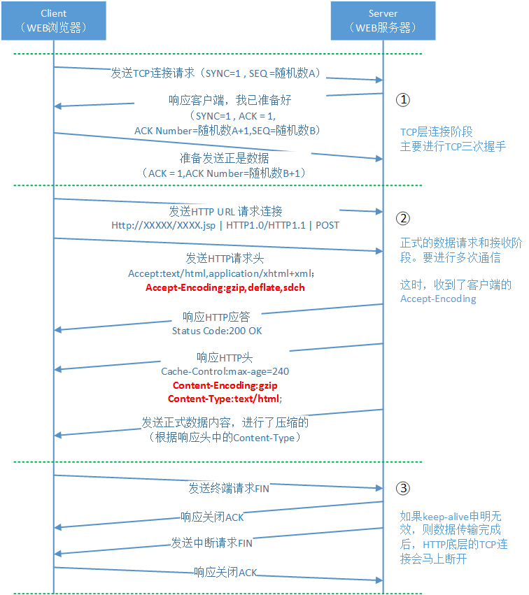

# 配置

主配置文件：/etc/nginx/nginx.conf

```nginx
# 指定运行Nginx的用户和用户组，缺省是nobody
user  nginx;
# 运行Nginx的进程数量
worker_processes  1;

# 错误日志存放位置和级别
error_log  /var/log/nginx/error.log warn;
# 指定主进程id文件的存放位置，虽然worker_processes > 1的情况下，会有很多进程，但是主进程只有一个
pid        /var/run/nginx.pid;


events {
  # 每一个进程可同时建立的最大连接数量
  worker_connections  1024;
  #连接规则，可以采用“kqueue、rtsig、epoll、select、poll、eventport”
  #use   epoll;
}


http {
  # Nginx后端服务配置项，主要用于负载均衡。“backendserver1”可以随便取名
  upstream backendserver1 {
    # nginx向后端服务器分配请求任务的方式，默认为轮询；ip_hash是基于IP的hash算法
    #ip_hash    
    # 后端服务器 ip:port ，如果有多个服务节点，这里就配置多个
    server 192.168.220.131:8080; 
    server 192.168.220.132:8080;    
    # “backup”表示，这个是一个备份节点，只有当所有节点失效后，nginx才会往这个节点分配请求任务
    #server 192.168.220.133:8080 backup;        
    # weight是固定权重，用于加权轮询方式。
    #server 192.168.220.134:8080 weight=100;    
  }
  # 安装nginx后，在conf目录下除了nginx.conf主配置文件以外，有很多模板配置文件，这里就是导入这些模板文件
  include       /etc/nginx/mime.types;
  # HTTP核心模块指令，这里设定默认类型为二进制流，也就是当文件类型未定义时使用这种方式
  default_type  application/octet-stream;

  # 日志格式
  log_format  main  '$remote_addr - $remote_user [$time_local] "$request" '
                    '$status $body_bytes_sent "$http_referer" '
                    '"$http_user_agent" "$http_x_forwarded_for"';

  # 访问日志文件存放的位置和级别
  access_log  /var/log/nginx/access.log  main;

  sendfile        on;
  #tcp_nopush     on;

  # 指定一个连接的等待时间（单位秒），如果超过等待时间，连接就会断掉。注意一定要设置，否则高并发情况下会产生性能问题。
  keepalive_timeout  65;

  # 开启数据压缩
  #gzip  on;

  # 包含其他配置文件
  include /etc/nginx/conf.d/*.conf;
}
```

## Nginx中内置的全局变量

- $content_length: 获取request中header部分的“Content_Length”值。
- $content_type: 获取request中header部分的“Content_type”值。
- $request_method: 请求方式，常用的有两种请求方式：POST、GET。
- $remote_addr: 发送请求的客户端ip。
- $remote_port: 发送请求的客户端端口。
- $request_uri: 含有参数的完整的初始URI。
- $server_addr: request到达的server的ip。
- $server_port: 请求到达的服务器的端口号。

## worker_processes和worker_connections

**worker_processes**：操作系统启动多少个工作进程运行Nginx。注意是工作进程，不是有多少个nginx工程。在Nginx运行的时候，会启动两种进程，一种是主进程master process；一种是工作进程worker process。主进程负责监控端口，协调工作进程的工作状态，分配工作任务；工作进程负责进行任务处理。一般这个参数要和操作系统的CPU内核数成倍数。

**worker_connections**：这个属性是指单个工作进程可以允许同时建立外部连接的数量。无论这个连接是外部主动建立的，还是内部建立的。这里需要注意的是，一个工作进程建立一个连接后，进程将打开一个文件副本。所以这个数量还受**操作系统设定的，进程最大可打开的文件数有关**。

**更改操作系统级别的“进程最大可打开文件数”的设置**：

1. 首先您需要操作系统的root权限。

2. 在主配置文件——/etc/security/limits.conf，的最后加入下面两句：

   ```
   * soft nofile 65535 
   * hard nofile 65535
   ```

   *soft（应用软件）级别限制的最大可打开文件数的限制，hard表示操作系统级别限制的最大可打开文件数的限制，“\*”表示所有用户都生效。

3. 保存这个文件后，配置是不会马上生效的，为了保证在本次shell会话中，配置马上有效，我们需要通过ulimit命令更改本次的shell会话设置（当然重启系统也是可以的）：

   ```shell
   ulimit -n 65535
   ```

   可以用ulimit -a 查看目前会话中的所有核心配置：

   ```shell
   ulimit -a
   ```

**更改Nginx软件级别的“进程最大可打开文件数”的设置：**

修改nginx.conf文件：

```nginx
user root root; 
worker_processes 4; 
worker_rlimit_nofile 65535;
…
events { 
  use epoll; 
  worker_connections 65535; 
}
…
```

配置完成后，请通过nginx -s reload命令重新启动Nginx。

查看nginx的进程情况：`ps -elf | grep nginx`。

查看工作进程的核心配置信息：`cat /proc/进程号/limits`。其中的“Max open files”就是最大连接数。


在充当服务器的时候，Nginx可同时承载的连接数量是：worker_processes * worker_connections。

在充当反向代理服务的时候，Nginx可同时承载的连接数量是：worker_processes * worker_connections / 4。

## gzip压缩

```nginx
#开启gzip压缩服务
gzip on;

#gzip压缩是要申请临时内存空间的，假设前提是压缩后大小是小于等于压缩前的。例如，如果原始文件大小为10K，那么它超过了8K，所以分配的内存是8 * 2 = 16K;再例如，原始文件大小为18K，很明显16K也是不够的，那么按照 8 * 2 * 2 = 32K的大小申请内存。如果没有设置，默认值是申请跟原始数据相同大小的内存空间去存储gzip压缩结果。 
gzip_buffers 2 8k;

#进行压缩的原始文件的最小大小值，也就是说如果原始文件小于5K，那么就不会进行压缩了 
gzip_min_length 5K;

#gzip压缩基于的http协议版本，默认就是HTTP 1.1 
gzip_http_version 1.1;

# gzip压缩级别1-9，级别越高压缩率越大，压缩时间也就越长CPU越高 
gzip_comp_level 5;

#需要进行gzip压缩的Content-Type的Header的类型。建议js、text、css、xml、json都要进行压缩；图片就没必要了，gif、jpge文件已经压缩得很好了，就算再压，效果也不好，而且还耗费cpu。 
gzip_types text/html text/plain text/css text/xml text/javascript application/javascript application/x-javascript application/xml application/json application/xml+rss;
```

注意：不是Nginx开启了gzip功能，HTTP响应的数据就一定会被压缩，除了满足Nginx设置的“需要压缩的http格式”以外，客户端（浏览器）也需要支持gzip。一个好消息是，目前大多数浏览器和API都支持http压缩。


浏览器和服务器进行gzip压缩的请求和处理返回过程：



## rewrite


## 服务实例的配置

服务实例的配置文件（HTTP）：/etc/nginx/conf.d/default.conf

```nginx
server {
  # 这个代理实例的监听端口
  listen       80;
  server_name  localhost;

  #charset koi8-r;
  #access_log  /var/log/nginx/host.access.log  main;

  location / {
    root   /usr/share/nginx/html;
    # root指定的目录中的默认展示页面
    index  index.html index.htm;
  }

  #error_page  404              /404.html;

  # redirect server error pages to the static page /50x.html
  #
  error_page   500 502 503 504  /50x.html;
  location = /50x.html {
    root   /usr/share/nginx/html;
  }

  # proxy the PHP scripts to Apache listening on 127.0.0.1:80
  #
  #location ~ \.php$ {
  #  proxy_pass   http://127.0.0.1;
  #}

  # pass the PHP scripts to FastCGI server listening on 127.0.0.1:9000
  #
  #location ~ \.php$ {
  #  root           html;
  #  fastcgi_pass   127.0.0.1:9000;
  #  fastcgi_index  index.php;
  #  fastcgi_param  SCRIPT_FILENAME  /scripts$fastcgi_script_name;
  #  include        fastcgi_params;
  #}

  # deny access to .htaccess files, if Apache's document root
  # concurs with nginx's one
  #
  #location ~ /\.ht {
  #  deny  all;
  #}
}
```


