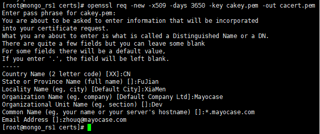

# 安装OpenSSL

验证是否安装了openssl：

```bash
which openssl
```

如果已安装则显示openssl所在路径，没安装则什么也不显示。

安装openssl：

```bash
apt install openssl libssl-dev
```

# 配置文件

在ubuntu中，openssl的配置文件一般位于`/etc/ssl/`目录下，名字是`openssl.cnf`。在Fedora、CentOS中，配置文件一般在`/etc/pki/tls`目录下。

根据openssl.cnf中的`[ CA_default ]`节的配置，创建相应文件：

```bash
touch /etc/pki/CA/{index.txt,serial}
#设置副本名称开始内容
echo 01 > /etc/pki/CA/serial
```


# 生成自签名的CA证书

一个根CA可以对次级CA进行签名，保证它的身份可靠，次级CA可以对用户证书进行签名，保证用户身份可靠。这样，`根CA --> 次级CA --> 用户证书`形成了一条证书链。当我们通过https连接到一台远程服务器，服务器会给我们发送自己的证书，通过证书链我们可以找到它到根CA，从而可以验证服务器身份的有效性。

## 生成私钥

创建一个用DES3加密的RSA私钥，密钥长度是2048：

```bash
# 有密码保护的密钥（至少四位的口令）
openssl genrsa -des3 -out cakey.pem 2048

# 无密码保护的密钥
openssl genrsa -out cakey.pem 2048
```

密钥文件名要与`openssl.cnf`的`private_key`指定的名字一致。

## 生成自签名的CA证书

有了私钥之后，就可以用它来生成自签名的证书。一般说来，生成一个证书需要两个步骤。第一步，由用户生成一个证书请求；第二步，由CA对这个证书进行签名。但是CA自己的证书比较特殊，因为它是自己对自己签名，所以openssl提供了简单的方式，一个命令就可以生成自签名的证书：

```bash
openssl req -new -x509 -days 3650 -key cakey.pem -out cacert.pem
```

* -x509：提示req命令生成自签名的CA。
* -key：指定了私钥。
* -out：指定了输出的CA证书名字。CA证书名要与`openssl.cnf`的`certificate`指定的名字一致。



> `Common Name`是要配置SSL的域名。注意：mayocase.com与www.mayocase.com是属于不同域名。这里使用“*”来做泛域名证书。

然后，把CA证书和私钥拷贝到`openssl.cnf`的`[ CA_default ]`所指定的目录下。也就是，`cakey.pem`复制到`private_key`指定的位置（通常是`/etc/pki/CA/private/cakey.pem`），`cacert.pem`复制到`certificate`指定的位置（通常是`/etc/pki/CA/cacert.pem`)。

完成后，我们可以检查以下证书的内容：

```bash
openssl x509 -noout -text -in cacert.pem
```

# 生成用户证书

```bash
openssl genrsa -des3 -out clientkey.pem 1024
openssl req -new -key clientkey.pem -out client.req
```

# 签发用户证书

```bash
openssl ca -out client.pem -infiles client.req
```

